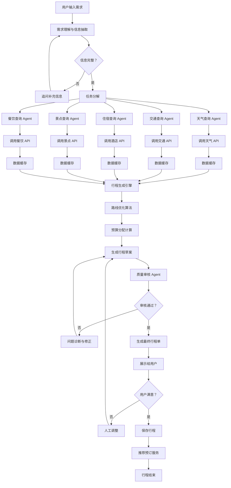
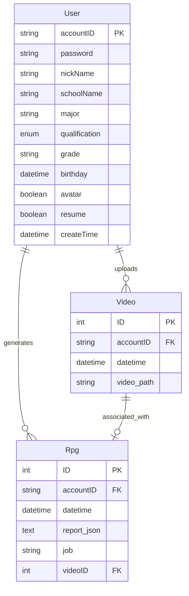

<!-- # 行程规划Agent 系统 - 详细开发文档

## 📋 文档目录

- [1. 项目概述](#1-项目概述)
- [2. 系统功能设计](#2-系统功能设计)
- [3. 技术架构设计](#3-技术架构设计)
- [4. 多智能体系统设计](#4-多智能体系统设计)
- [5. API 集成方案](#5-api-集成方案)
- [6. 核心功能模块详解](#6-核心功能模块详解)
- [7. 数据流与工作流程](#7-数据流与工作流程)
- [8. 技术栈选型](#8-技术栈选型)
- [9. 开发计划](#9-开发计划)
- [10. 风险评估与应对](#10-风险评估与应对)

---

## 1. 项目概述

### 1.1 项目背景

随着 AI 技术的快速发展，传统的旅行规划方式已经无法满足现代旅行者对个性化、实时性和准确性的需求。本项目旨在开发一个基于多智能体协作的行程规划Agent 系统，通过整合多个真实 API 数据源，为用户提供从旅行前规划、旅行中安排到旅行后总结的全流程智能化服务。

### 1.2 项目目标

**核心目标：**
- ✅ 实现基于真实数据的行程规划（天气、交通、住宿、景点等）
- ✅ 提供个性化、可执行的详细行程安排
- ✅ 支持旅行前、中、后全流程管理
- ✅ 确保数据的实时性、准确性和完整性
- ✅ 降低用户旅行规划的时间成本

### 1.3 目标用户

- **个人旅行者**：需要个性化行程规划的自由行游客
- **家庭出游**：需要全面考虑多方面因素的的家庭旅行
- **商务差旅**：需要高效安排行程的商务人士
- **旅行爱好者**：追求深度体验和特色行程的旅行者
- **旅行社/导游**：需要快速生成专业行程的从业人员

### 1.4 核心价值主张

| 价值维度 | 传统方式 | 本系统优势 |
|---------|---------|-----------|
| 数据真实性 | 手动查询多个平台，信息可能过时 | 实时调用 API，保证数据准确性 |
| 规划效率 | 耗时数小时甚至数天 | 分钟级生成完整行程 |
| 个性化程度 | 模板化推荐，缺乏针对性 | 基于用户偏好和约束条件深度定制 |
| 动态调整 | 难以应对突发变化 | 实时监控，智能调整行程 |
| 成本控制 | 难以全局优化预算 | 智能预算分配和优化建议 |

---

## 2. 系统功能设计

### 2.1 功能架构图

```
┌─────────────────────────────────────────────────────────────┐
│                     用户交互层                               │
│  ┌──────────┐  ┌──────────┐  ┌──────────┐  ┌──────────┐   │
│  │ Web 端    │  │ 移动端   │  │ 小程序   │  │ API 接口  │   │
│  └──────────┘  └──────────┘  └──────────┘  └──────────┘   │
└─────────────────────────────────────────────────────────────┘
                            ↓
┌─────────────────────────────────────────────────────────────┐
│                   智能体协调层                               │
│  ┌────────────────────────────────────────────────────┐    │
│  │           主控智能体 (Orchestrator Agent)          │    │
│  │  - 需求理解  - 任务分解  - 流程控制  - 质量审核    │    │
│  └────────────────────────────────────────────────────┘    │
└─────────────────────────────────────────────────────────────┘
                            ↓
┌─────────────────────────────────────────────────────────────┐
│                   专业智能体层                               │
│  ┌─────────┐ ┌─────────┐ ┌─────────┐ ┌─────────┐          │
│  │目的地  │ │交通    │ │住宿    │ │餐饮    │          │
│  │分析 Agent│ │规划Agent│ │推荐Agent│ │推荐Agent│          │
│  └─────────┘ └─────────┘ └─────────┘ └─────────┘          │
│  ┌─────────┐ ┌─────────┐ ┌─────────┐ ┌─────────┐          │
│  │景点    │ │天气    │ │预算    │ │安全    │          │
│  │规划Agent│ │查询 Agent│ │管理 Agent│ │评估 Agent│          │
│  └─────────┘ └─────────┘ └─────────┘ └─────────┘          │
└─────────────────────────────────────────────────────────────┘
                            ↓
┌─────────────────────────────────────────────────────────────┐
│                   工具与服务层                               │
│  ┌─────────┐ ┌─────────┐ ┌─────────┐ ┌─────────┐          │
│  │天气 API  │ │交通 API  │ │酒店 API  │ │地图 API  │          │
│  └─────────┘ └─────────┘ └─────────┘ └─────────┘          │
│  ┌─────────┐ ┌─────────┐ ┌─────────┐ ┌─────────┐          │
│  │景点 API  │ │餐饮 API  │ │汇率 API  │ │新闻 API  │          │
│  └─────────┘ └─────────┘ └─────────┘ └─────────┘          │
└─────────────────────────────────────────────────────────────┘
                            ↓
┌─────────────────────────────────────────────────────────────┐
│                   数据存储层                                 │
│  ┌─────────┐  ┌─────────┐  ┌─────────┐  ┌─────────┐       │
│  │用户数据 │  │行程数据 │  │知识库   │  │日志缓存 │       │
│  │  MySQL  │  │ MongoDB │  │Neo4j    │  │ Redis   │       │
│  └─────────┘  └─────────┘  └─────────┘  └─────────┘       │
└─────────────────────────────────────────────────────────────┘
```

### 2.2 核心功能清单

#### 2.2.1 旅行前规划功能

**1. 智能需求收集**
- 目的地选择（支持多选、模糊搜索）
- 时间预算设定（出发日期、行程天数、灵活度）
- 财务预算设定（总预算、分项预算）
- 人员信息（人数、年龄结构、特殊需求）
- 兴趣偏好（自然风光、历史文化、美食购物、冒险运动等）
- 出行方式偏好（飞机、高铁、自驾等）
- 住宿偏好（星级酒店、民宿、青旅等）

**2. 目的地分析与推荐**
- 多维度目的地评分系统
- 最佳旅行时间分析
- 消费水平评估
- 安全性评估
- 签证要求查询
- 文化习俗提示

**3. 详细行程生成**
- 每日行程安排（精确到小时）
- 景点游览顺序优化
- 交通接驳方案
- 餐饮推荐（早中晚餐 + 特色餐厅）
- 住宿推荐（符合预算和位置要求）
- 备选方案设计

**4. 预算细化与优化**
- 交通费用估算（往返 + 当地）
- 住宿费用估算
- 餐饮费用估算
- 景点门票费用
- 购物预算
- 应急备用金
- 费用优化建议

**5. 行前准备清单**
- 证件检查清单
- 行李打包建议（基于天气和活动）
- 必备物品推荐
- 保险购买建议
- 通讯和网络方案
- 货币兑换建议

#### 2.2.2 旅行中服务功能

**1. 实时行程管理**
- 每日行程提醒
- 天气预报更新
- 交通状况监控
- 景点开放时间变更通知
- 行程动态调整建议

**2. 导航与导览**
- 实时地图导航
- 公共交通路线查询
- 步行导航
- 景点语音讲解
- AR 实景导航（可选）

**3. 即时推荐服务**
- 附近餐厅推荐
- 临时景点推荐
- 紧急医疗服务
- 使领馆联系方式
- 语言翻译协助

**4. 费用追踪**
- 实时消费记录
- 预算执行监控
- 超支预警
- 汇率换算

**5. 安全保障**
- 安全区域提示
- 风险预警（自然灾害、政治局势等）
- 紧急联系人一键呼叫
- 位置共享功能
- SOS 求救功能

#### 2.2.3 旅行后总结功能

**1. 行程回顾**
- 旅行轨迹地图
- 照片整理与时间线
- 足迹统计（城市、景点、里程）
- 费用汇总分析

**2. 体验分享**
- 游记自动生成
- 攻略分享
- 点评和建议
- 社交网络分享

**3. 智能改进**
- 行程满意度评估
- 改进建议收集
- 个性化推荐优化
- 用户画像完善

**4. 纪念服务**
- 旅行相册制作
- 纪念品推荐
- 下次旅行灵感推荐

### 2.3 用户体验流程

#### 2.3.1 新用户首次使用流程

```
注册/登录 → 填写基础偏好 → 创建第一个行程 → 查看示例行程 → 
开始自定义规划 → 保存/分享行程
```

#### 2.3.2 行程创建流程

```
输入目的地 → 设置时间预算 → 设置财务预算 → 选择兴趣标签 → 
确认出行人信息 → 生成初步行程 → 人工调整优化 → 确认最终行程 → 
预订相关服务（可选）→ 导出行程单
```

---

## 3. 技术架构设计

### 3.1 整体架构

采用**微服务架构 + 事件驱动**的混合架构模式

```
┌─────────────────────────────────────────────────────────┐
│                    客户端层                              │
│  Web(React/Vue) │ Mobile(Flutter) │ Mini Program      │
└─────────────────────────────────────────────────────────┘
                          │
                          ▼
┌─────────────────────────────────────────────────────────┐
│                    API 网关层                             │
│         Kong / APISIX / Nginx + Lua                    │
│    认证鉴权 │ 限流熔断 │ 负载均衡 │ 日志监控           │
└─────────────────────────────────────────────────────────┘
                          │
                          ▼
┌─────────────────────────────────────────────────────────┐
│                   业务服务层                             │
│  ┌──────────┐  ┌──────────┐  ┌──────────┐             │
│  │用户服务  │  │行程服务  │  │订单服务  │  ...          │
│  └──────────┘  └──────────┘  └──────────┘             │
└─────────────────────────────────────────────────────────┘
                          │
                          ▼
┌─────────────────────────────────────────────────────────┐
│                 多智能体服务层                           │
│  ┌────────────────────────────────────────────────┐    │
│  │        Agent Orchestrator Service              │    │
│  │  (基于 LangGraph / AutoGen / CrewAI)           │    │
│  └────────────────────────────────────────────────┘    │
│  ┌─────────┐ ┌─────────┐ ┌─────────┐ ┌─────────┐     │
│  │Planner  │ │Searcher │ │Reviewer │ │Executor │     │
│  │ Agent   │ │ Agent   │ │ Agent   │ │ Agent   │     │
│  └─────────┘ └─────────┘ └─────────┘ └─────────┘     │
└─────────────────────────────────────────────────────────┘
                          │
                          ▼
┌─────────────────────────────────────────────────────────┐
│                  外部 API 集成层                          │
│  ┌────────────────────────────────────────────────┐    │
│  │           API Gateway / MCP Server             │    │
│  └────────────────────────────────────────────────┘    │
│  Weather │ Flight │ Train │ Hotel │ Map │ Attraction  │
└─────────────────────────────────────────────────────────┘
                          │
                          ▼
┌─────────────────────────────────────────────────────────┐
│                   数据存储层                             │
│  MySQL │ MongoDB │ Redis │ Neo4j │ Elasticsearch      │
└─────────────────────────────────────────────────────────┘
```

### 3.2 架构设计原则

1. **高可用性**：服务冗余部署，故障自动转移
2. **可扩展性**：水平扩展能力，支持弹性伸缩
3. **高性能**：缓存策略，异步处理，CDN 加速
4. **安全性**：数据加密，访问控制，审计日志
5. **可维护性**：模块化设计，清晰的服务边界
6. **可观测性**：完善的监控、日志、追踪体系

---

## 4. 多智能体系统设计

### 4.1 智能体架构模式

采用**分层协作式多智能体架构**

```
┌──────────────────────────────────────────────────────────┐
│                User Interface Layer                      │
│                  (用户交互界面)                           │
└──────────────────────────────────────────────────────────┘
                           │
                           ▼
┌──────────────────────────────────────────────────────────┐
│              Coordinator Agent (协调者)                   │
│  - 用户需求理解和解析                                     │
│  - 任务分解和分配                                         │
│  - 流程控制和调度                                         │
│  - 结果汇总和质量审核                                     │
│  - 冲突解决和异常处理                                     │
└──────────────────────────────────────────────────────────┘
                           │
        ┌──────────────────┼──────────────────┐
        ▼                  ▼                  ▼
┌──────────────┐  ┌──────────────┐  ┌──────────────┐
│ Planning     │  │ Information  │  │ Execution    │
│ Group        │  │ Group        │  │ Group        │
│              │  │              │  │              │
│ • Itinerary  │  │ • Weather    │  │ • Booking    │
│   Agent      │  │   Agent      │  │   Agent      │
│ • Route      │  │ • Traffic    │  │ • Payment    │
│   Agent      │  │   Agent      │  │   Agent      │
│ • Budget     │  │ • Attraction │  │ • Ticket     │
│   Agent      │  │   Agent      │  │   Agent      │
│ • Time       │  │ • Hotel      │  │ • Check-in   │
│   Agent      │  │   Agent      │  │   Agent      │
│              │  │ • Restaurant │  │              │
│              │  │   Agent      │  │              │
│              │  │ • Safety     │  │              │
│              │  │   Agent      │  │              │
└──────────────┘  └──────────────┘  └──────────────┘
                           │
                           ▼
┌──────────────────────────────────────────────────────────┐
│              Tool & API Integration Layer                │
│            (工具库和外部 API 集成层)                        │
└──────────────────────────────────────────────────────────┘
```

### 4.2 核心智能体详细设计

#### 4.2.1 Coordinator Agent（协调者智能体）

**职责：**
- 理解用户的自然语言输入
- 提取关键信息（目的地、时间、预算、偏好等）
- 制定任务执行计划
- 分配子任务给专业智能体
- 监控任务执行进度
- 汇总各智能体的输出结果
- 质量审核和一致性检查
- 处理异常和冲突

**System Prompt 示例：**
```
你是一个专业的旅行规划协调员。你的任务是：
1. 仔细倾听用户的需求，包括目的地、时间、预算、兴趣偏好等
2. 将复杂的旅行规划任务分解为可管理的子任务
3. 协调各个专业智能体（天气、交通、住宿、景点等）协同工作
4. 确保所有子任务的执行结果一致且完整
5. 最终生成一份详细、可行、优化的旅行行程表

在协调过程中，你需要：
- 确保信息的准确性和时效性
- 平衡用户偏好与实际约束条件
- 提供多个备选方案供用户选择
- 关注细节，包括开放时间、交通接驳、费用等
```

#### 4.2.2 Planner Group（规划组智能体）

##### Itinerary Agent（行程规划智能体）

**职责：**
- 根据用户时间和目的地生成每日行程框架
- 合理安排景点游览顺序
- 考虑地理位置优化路线
- 预留充足的休息和用餐时间
- 提供备选方案

**工具调用：**
- 景点数据库查询
- 地图 API（计算距离和时间）
- 景点开放时间 API

##### Route Agent（路线优化智能体）

**职责：**
- 优化每日游览路线
- 计算交通时间和成本
- 提供多种交通方式选择
- 避开拥堵时段和路段

**工具调用：**
- 地图导航 API
- 实时交通 API
- 公共交通查询 API

##### Budget Agent（预算管理智能体）

**职责：**
- 根据总预算进行合理分配
- 各项费用估算和汇总
- 提供省钱建议
- 实时追踪预算执行情况

**工具调用：**
- 价格数据库
- 汇率 API
- 历史价格趋势分析

#### 4.2.3 Information Group（信息组智能体）

##### Weather Agent（天气查询智能体）

**职责：**
- 查询目的地历史天气数据
- 获取旅行期间天气预报
- 提供穿衣和装备建议
- 评估天气对行程的影响

**API 集成：**
- OpenWeatherMap API
- AccuWeather API
- 中国天气网 API

##### Traffic Agent（交通查询智能体）

**职责：**
- 查询航班信息和价格
- 查询火车/高铁班次
- 查询长途客车信息
- 比较不同交通方式的优劣

**API 集成：**
- 航旅纵横 API
- 携程旅行 API
- 12306 API（火车）
- Skyscanner API（国际航班）

##### Attraction Agent（景点信息智能体）

**职责：**
- 查询景点详细信息
- 获取门票价格和优惠政策
- 查询开放时间和游玩时长建议
- 收集游客评价和推荐度

**API 集成：**
- 高德地图 POI API
- 百度地图 POI API
- 美团/大众点评 API
- TripAdvisor API

##### Hotel Agent（住宿推荐智能体）

**职责：**
- 根据预算和位置推荐住宿
- 查询酒店设施和评价
- 比较不同平台价格
- 提供预订建议

**API 集成：**
- 携程酒店 API
- Booking.com API
- Airbnb API
- 美团酒店 API

##### Restaurant Agent（餐饮推荐智能体）

**职责：**
- 推荐当地特色美食
- 根据位置和口味筛选餐厅
- 查询人均消费和评价
- 提供用餐时间建议

**API 集成：**
- 大众点评 API
- 美团 API
- Yelp API（国际）
- OpenTable API

##### Safety Agent（安全评估智能体）

**职责：**
- 查询目的地安全状况
- 提供旅行风险提示
- 收集紧急联系方式
- 评估特殊活动风险等级

**API 集成：**
- 外交部领事司 API
- 世界卫生组织 API
- 当地警察局联系方式
- 保险公司救援服务

#### 4.2.4 Execution Group（执行组智能体）

##### Booking Agent（预订智能体）

**职责：**
- 协助完成机票/车票预订
- 协助完成酒店预订
- 协助完成景点门票预订
- 生成预订确认信息

##### Payment Agent（支付智能体）

**职责：**
- 对接支付网关
- 处理支付请求
- 记录支付信息
- 处理退款申请

### 4.3 智能体通信机制

#### 4.3.1 消息传递协议

采用**发布 - 订阅模式** + **请求 - 响应模式**的混合通信方式

```python
# 消息格式示例
{
    "message_id": "uuid",
    "timestamp": "ISO8601",
    "sender_agent": "coordinator",
    "receiver_agent": "weather_agent",
    "message_type": "request/response/notification",
    "priority": "high/medium/low",
    "content": {
        "action": "get_weather_forecast",
        "parameters": {
            "location": "Beijing",
            "start_date": "2026-04-01",
            "end_date": "2026-04-07"
        }
    },
    "correlation_id": "关联的请求 ID"
}
```

#### 4.3.2 任务调度策略

**1. 并行执行：** 独立任务并行处理（如同时查询天气和交通）
**2. 串行执行：** 依赖任务按序执行（如先确定日期再查价格）
**3. 优先级队列：** 紧急任务优先处理
**4. 超时重试机制：** 失败任务自动重试

### 4.4 智能体协作流程示例

**场景：用户要规划北京 5 日游**

```
1. Coordinator Agent 接收用户需求
   "我想去北京玩 5 天，预算 8000 元，喜欢历史文化和美食"

2. Coordinator 分解任务：
   - → Weather Agent: 查询北京未来天气
   - → Traffic Agent: 查询往返北京交通
   - → Attraction Agent: 查询北京历史文化景点
   - → Restaurant Agent: 查询北京特色美食
   - → Hotel Agent: 查询北京住宿
   - → Budget Agent: 预算分配

3. 各 Agent 并行执行：
   - Weather Agent 返回：4 月北京气温 15-25°C，晴朗为主
   - Traffic Agent 返回：往返机票 2000 元，高铁 1200 元
   - Attraction Agent 返回：故宫、长城、颐和园等 15 个景点
   - Restaurant Agent 返回：全聚德、东来顺等 20 家餐厅
   - Hotel Agent 返回：50 家符合预算的酒店

4. Planner Group 整合信息：
   - Itinerary Agent: 生成 5 日详细行程
   - Route Agent: 优化每日路线
   - Budget Agent: 核算总费用

5. Reviewer Agent 审核：
   - 检查时间安排是否合理
   - 验证预算是否超支
   - 确认信息准确性

6. Coordinator 汇总输出：
   - 生成完整行程单
   - 提供备选方案
   - 输出预算明细
```

---

## 5. API 集成方案

### 5.1 API 分类与选型

#### 5.1.1 天气类 API

| API 名称 | 提供商 | 功能 | 价格 | 推荐度 |
|---------|--------|------|------|--------|
| OpenWeatherMap | OpenWeather | 全球天气预报 | 免费$0/月，付费$40/月起 | ⭐⭐⭐⭐⭐ |
| AccuWeather | AccuWeather | 精准天气预报 | 免费 50 次/日，付费$25/月起 | ⭐⭐⭐⭐ |
| 中国天气网 | 中国气象局 | 国内天气 | 需申请，价格面议 | ⭐⭐⭐⭐ |
| WeatherAPI | WeatherAPI.com | 天气 + 天文 | 免费 100 万次/月 | ⭐⭐⭐⭐ |

**推荐方案：** OpenWeatherMap（国际）+ 中国天气网（国内）

#### 5.1.2 交通类 API

**航班查询：**
| API 名称 | 提供商 | 覆盖范围 | 价格模式 |
|---------|--------|---------|---------|
| 航旅纵横 | 中国航信 | 国内为主 | 商务合作 |
| Skyscanner | Skyscanner | 全球 | 免费 + 佣金 |
| 携程旅行 API | 携程 | 全球 | 分销返佣 |
| Amadeus | Amadeus | 全球 | 按调用量收费 |

**火车/高铁：**
| API 名称 | 提供商 | 特点 |
|---------|--------|------|
| 12306 官方 API | 中国铁路总公司 | 最权威，需合作 |
| 携程火车票 API | 携程 | 商业化接口 |
| 飞猪火车票 API | 阿里巴巴 | 商业化接口 |

**客车/公交：**
| API 名称 | 提供商 | 功能 |
|---------|--------|------|
| 高德地图 API | 高德 | 公交地铁查询 |
| 百度地图 API | 百度 | 路线规划 |
| 车来了 API | 双开科技 | 实时公交 |

**推荐方案：** 
- 国内：携程旅行 API（航班）+ 12306（火车）+ 高德地图（市内交通）
- 国际：Amadeus（航班）+ Google Maps（交通）

#### 5.1.3 住宿类 API

| API 名称 | 提供商 | 特点 | 合作模式 |
|---------|--------|------|---------|
| 携程酒店 API | 携程 | 国内资源丰富 | 分销返佣 |
| Booking.com API | Booking | 国际酒店多 | 联盟营销 |
| Airbnb API | Airbnb | 民宿特色 | 需申请 |
| 美团酒店 API | 美团 | 性价比高 | 分销合作 |
| Agoda API | Agoda | 亚洲优势 | 联盟营销 |

**推荐方案：** 携程（国内）+ Booking.com（国际）+ 美团（经济型）

#### 5.1.4 景点类 API

| API 名称 | 提供商 | 数据类型 | 价格 |
|---------|--------|---------|------|
| 高德地图 POI | 高德 | 景点信息 + 评论 | 免费额度内免费 |
| 百度地图 POI | 百度 | 景点信息 + 路线 | 免费额度内免费 |
| 美团/大众点评 | 美团 | 门票 + 评论 | 商务合作 |
| TripAdvisor API | TripAdvisor | 国际景点评价 | 免费 + 佣金 |
| Klook API | Klook | 景点门票预订 | 分销返佣 |

**推荐方案：** 高德地图（基础信息）+ 美团（门票）+ TripAdvisor（国际）

#### 5.1.5 餐饮类 API

| API 名称 | 提供商 | 覆盖范围 | 功能 |
|---------|--------|---------|------|
| 大众点评 API | 美团 | 国内 | 餐厅信息 + 评价 |
| 美团 API | 美团 | 国内 | 团购 + 外卖 |
| Yelp API | Yelp | 国际 | 餐厅评价 |
| OpenTable API | OpenTable | 国际 | 餐厅预订 |
| Zomato API | Zomato | 全球 | 餐厅发现 |

**推荐方案：** 大众点评（国内）+ Yelp（国际）

#### 5.1.6 地图与导航 API

| API 名称 | 提供商 | 主要功能 | 价格 |
|---------|--------|---------|------|
| 高德地图 API | 高德 | 地图 + 导航 +POI | 免费 3 万次/日 |
| 百度地图 API | 百度 | 地图 + 导航 +POI | 免费 2 百万次/年 |
| Google Maps API | Google | 全球地图服务 | $200 免费额度/月 |
| Mapbox API | Mapbox | 定制地图 | 免费 5 万次/月 |

**推荐方案：** 高德/百度（国内）+ Google Maps（国际）

#### 5.1.7 其他辅助 API

**汇率查询：**
- 中国银行外汇牌价 API
- Open Exchange Rates API
- Fixer.io API

**新闻资讯：**
- 今日头条 API
- 新浪新闻 API
- NewsAPI（国际新闻）

**疫情/健康：**
- 国家卫健委 API
- 世界卫生组织 API
- 各地疾控中心公告

### 5.2 API 集成架构

```
┌─────────────────────────────────────────────────────────┐
│                Application Layer                        │
│                 (应用层 - 智能体)                        │
└─────────────────────────────────────────────────────────┘
                          │
                          ▼
┌─────────────────────────────────────────────────────────┐
│              API Gateway Layer                          │
│           (统一 API 网关层)                              │
│  • 认证鉴权  • 限流熔断  • 缓存代理  • 监控日志         │
│  • 统一错误处理  • 数据格式转换  • 请求路由            │
└─────────────────────────────────────────────────────────┘
                          │
                          ▼
┌─────────────────────────────────────────────────────────┐
│             MCP (Model Context Protocol)                │
│           (模型上下文协议层 - 可选)                       │
│  • 统一工具调用接口  • 上下文管理  • 资源发现          │
└─────────────────────────────────────────────────────────┘
                          │
                          ▼
┌─────────────────────────────────────────────────────────┐
│            External API Adapters                        │
│          (外部 API 适配器层)                             │
│  ┌─────────┐ ┌─────────┐ ┌─────────┐ ┌─────────┐      │
│  │Weather  │ │Traffic  │ │Hotel    │ │Map      │      │
│  │Adapter  │ │Adapter  │ │Adapter  │ │Adapter  │      │
│  └─────────┘ └─────────┘ └─────────┘ └─────────┘      │
└─────────────────────────────────────────────────────────┘
                          │
                          ▼
┌─────────────────────────────────────────────────────────┐
│              External APIs                              │
│         (外部 API 服务商)                                │
│  OpenWeather │ 携程 │ 高德 │ Google │ Booking...       │
└─────────────────────────────────────────────────────────┘
```

### 5.3 API 调用优化策略

#### 5.3.1 缓存策略

```python
# 多级缓存架构
L1: 内存缓存 (Redis) - 高频数据（汇率、天气）
L2: 数据库缓存 (MongoDB) - 低频数据（景点信息、酒店信息）
L3: CDN 缓存 - 静态资源（图片、描述文本）

缓存过期策略：
- 实时数据（天气、交通）：5-15 分钟
- 半实时数据（价格、库存）：1-6 小时
- 静态数据（景点介绍、图片）：24 小时 -7 天
```

#### 5.3.2 降级策略

```python
# API 故障时的降级方案
primary_api = get_weather_from_openweathermap()
if primary_api.failed:
    fallback_api = get_weather_from_accuweather()
    if fallback_api.failed:
        cached_data = get_cached_weather()
        if cached_data.expired:
            return "天气数据暂时不可用，请稍后重试"
```

#### 5.3.3 成本控制

```python
# API 调用成本优化
1. 免费额度优先使用
2. 批量查询代替单次查询
3. 按需调用，避免无效请求
4. 监控异常调用，防止恶意刷量
5. 定期review API 使用情况，优化供应商组合
```

### 5.4 API Key 管理

```yaml
# 使用环境变量 + 密钥管理服务
api_keys:
  weather:
    openweathermap: ${OPENWEATHER_API_KEY}
    accuweather: ${ACCUWEATHER_API_KEY}
  
  traffic:
    ctrip: ${CTRIP_API_KEY}
    amadeus: ${AMADEUS_API_KEY}
  
  map:
    gaode: ${GAODE_API_KEY}
    google: ${GOOGLE_MAPS_API_KEY}

# 安全措施：
# 1. 禁止硬编码在代码中
# 2. 使用 AWS Secrets Manager / Azure Key Vault
# 3. 定期轮换密钥
# 4. 限制 API Key 的使用范围和配额
```

---

## 6. 核心功能模块详解

### 6.1 用户需求理解模块

#### 6.1.1 输入方式

**1. 结构化表单输入**
```
目的地：[北京 ________]
出发日期：[📅 2026-04-01]
行程天数：[5 天]
总预算：[¥ 8000 ____]
出行人数：[2 成人，1 儿童]
兴趣偏好：[☑️ 历史文化 ☑️ 美食 ☐ 购物 ☐ 自然风光]
```

**2. 自然语言输入**
```
"我想 4 月份带家人去北京玩 5 天左右，预算大概 8000 块，
我们比较喜欢历史古迹和当地美食，希望能安排得轻松一点"
```

**3. 混合输入**
- 部分字段结构化 + 自由文本描述

#### 6.1.2 意图识别与信息抽取

使用**大语言模型 + 规则引擎**的组合方式

```python
from langchain.chat_models import ChatOpenAI
from pydantic import BaseModel, Field

class TravelRequirement(BaseModel):
    """旅行需求结构化模型"""
    
    destination: str = Field(description="目的地")
    start_date: str = Field(description="出发日期 YYYY-MM-DD")
    duration: int = Field(description="行程天数")
    budget: float = Field(description="总预算（元）")
    adults: int = Field(description="成人数量")
    children: int = Field(description="儿童数量")
    elderly: int = Field(description="老人数量")
    interests: List[str] = Field(description="兴趣标签列表")
    preferences: Dict[str, Any] = Field(description="其他偏好")
    special_requirements: str = Field(description="特殊需求")

# 使用 LLM 进行信息抽取
llm = ChatOpenAI(model="gpt-4")
parser = PydanticOutputParser(pydantic_object=TravelRequirement)

prompt = PromptTemplate(
    template="从以下用户输入中提取旅行需求信息:\n{user_input}\n{format_instructions}",
    input_variables=["user_input"],
    partial_variables={"format_instructions": parser.get_format_instructions()}
)

chain = prompt | llm | parser
result = chain.invoke({"user_input": user_text})
```

#### 6.1.3 需求澄清机制

当信息不完整或模糊时，主动询问用户：

```
AI: 您好！我注意到您想去北京旅行 5 天。为了更好地为您规划，
   我还需要了解一些信息：
   
   1. 您计划什么时候出发呢？（具体日期或月份）
   2. 您的预算大概是多少？（包括交通、住宿、餐饮等）
   3. 这次出行有几位？有老人或小孩吗？
   4. 您对哪些类型的景点比较感兴趣？
      □ 历史文化（故宫、长城等）
      □ 自然风光（颐和园、北海等）
      □ 现代都市（CBD、鸟巢等）
      □ 美食探索（烤鸭、小吃等）
      □ 购物体验（王府井、三里屯等）
   
   请告诉我您的想法，我会据此为您制定详细的行程方案！
```

### 6.2 行程生成引擎

#### 6.2.1 行程生成算法

采用**约束满足问题 (CSP) + 启发式优化**的方法

```python
class ItineraryGenerator:
    def __init__(self):
        self.constraints = []
        self.objectives = []
    
    def generate(self, requirements, attractions, constraints):
        """
        生成行程的核心算法
        """
        # 1. 初始化搜索空间
        search_space = self.build_search_space(
            attractions, 
            requirements.duration
        )
        
        # 2. 应用硬约束过滤
        feasible_solutions = self.apply_hard_constraints(
            search_space, 
            constraints
        )
        
        # 3. 多目标优化
        optimized = self.multi_objective_optimization(
            feasible_solutions,
            objectives=[
                self.minimize_travel_time,
                self.maximize_interest_match,
                self.balance_daily_budget,
                self.avoid_crowds
            ]
        )
        
        # 4. 生成最终方案
        itinerary = self.build_itinerary(optimized, requirements)
        
        return itinerary
    
    def build_search_space(self, attractions, days):
        """构建所有可能的景点组合"""
        # 使用回溯算法生成合理的景点排列组合
        pass
    
    def apply_hard_constraints(self, solutions, constraints):
        """应用硬约束（必须满足的条件）"""
        filtered = []
        for solution in solutions:
            if self.check_constraints(solution, constraints):
                filtered.append(solution)
        return filtered
    
    def multi_objective_optimization(self, solutions, objectives):
        """多目标优化（帕累托最优）"""
        # 使用遗传算法或模拟退火算法
        pass
```

#### 6.2.2 行程安排规则引擎

```python
class RuleEngine:
    def __init__(self):
        self.rules = self.load_rules()
    
    def load_rules(self):
        return [
            # 时间规则
            {
                "name": "minimum_visit_duration",
                "condition": "attraction.type == 'museum'",
                "action": "set_min_hours(2)"
            },
            {
                "name": "opening_hours_check",
                "condition": "always",
                "action": "verify_opening_hours()"
            },
            
            # 体力规则
            {
                "name": "rest_break",
                "condition": "continuous_activity_hours > 3",
                "action": "insert_rest_break(30_minutes)"
            },
            {
                "name": "walking_distance_limit",
                "condition": "age_group == 'elderly'",
                "action": "max_walking_distance(2km)"
            },
            
            # 餐饮规则
            {
                "name": "meal_time_arrangement",
                "condition": "time in [12:00-13:00, 18:00-19:00]",
                "action": "arrange_meal()"
            },
            
            # 地理规则
            {
                "name": "cluster_visits",
                "condition": "same_district",
                "action": "schedule_same_day()"
            }
        ]
    
    def apply_rules(self, itinerary_draft):
        """应用规则到行程草案"""
        for rule in self.rules:
            if eval(rule["condition"]):
                exec(rule["action"])
        return itinerary_draft
```

#### 6.2.3 智能路线优化

使用**旅行商问题 (TSP)** 的变种算法

```python
import networkx as nx
from ortools.constraint_solver import routing_enums_pb2
from ortools.constraint_solver import pywrapcp

def optimize_daily_route(attractions, start_point, end_point):
    """
    优化单日游览路线
    考虑因素：距离、时间、交通方式、景点热度
    """
    # 构建距离矩阵
    distance_matrix = calculate_distance_matrix(attractions)
    
    # 创建路由模型
    manager = pywrapcp.RoutingIndexManager(
        len(attractions), 
        1,  # 车辆数（1 个人）
        0,  # 起点索引
        len(attractions)-1  # 终点索引
    )
    
    routing = pywrapcp.RoutingModel(manager)
    
    # 定义距离回调
    transit_callback_index = routing.RegisterTransitCallback(distance_matrix)
    routing.SetArcCostEvaluatorOfAllVehicles(transit_callback_index)
    
    # 添加时间窗约束（景点开放时间）
    # ...
    
    # 求解
    parameters = pywrapcp.DefaultRoutingSearchParameters()
    parameters.first_solution_strategy = (
        routing_enums_pb2.FirstSolutionStrategy.PATH_CHEAPEST_ARC
    )
    
    solution = routing.SolveWithParameters(parameters)
    
    return extract_route(solution, manager, routing)
```

### 6.3 预算管理系统

#### 6.3.1 预算分配模型

```python
class BudgetAllocator:
    """智能预算分配器"""
    
    # 默认预算分配比例（可根据用户偏好调整）
    DEFAULT_ALLOCATION = {
        'transportation': 0.30,  # 交通 30%
        'accommodation': 0.25,   # 住宿 25%
        'dining': 0.20,          # 餐饮 20%
        'attractions': 0.15,     # 景点门票 15%
        'shopping': 0.05,        # 购物 5%
        'emergency': 0.05        # 应急 5%
    }
    
    def allocate(self, total_budget, preferences, destination_info):
        """
        根据用户偏好和目的地消费水平进行预算分配
        """
        allocation = self.DEFAULT_ALLOCATION.copy()
        
        # 根据用户偏好调整
        if preferences.get('foodie'):
            allocation['dining'] += 0.10
            allocation['shopping'] -= 0.05
        
        if preferences.get('budget_conscious'):
            allocation['accommodation'] -= 0.05
            allocation['emergency'] += 0.05
        
        # 根据目的地消费水平调整
        cost_index = destination_info.get('cost_index', 1.0)
        allocation['accommodation'] *= cost_index
        
        # 计算具体金额
        detailed_budget = {}
        for category, ratio in allocation.items():
            detailed_budget[category] = total_budget * ratio
        
        return detailed_budget
```

#### 6.3.2 实时费用追踪

```python
class ExpenseTracker:
    """旅行费用追踪器"""
    
    def __init__(self, budget_plan):
        self.budget_plan = budget_plan
        self.actual_expenses = defaultdict(float)
        self.transactions = []
    
    def add_expense(self, category, amount, description, timestamp):
        """记录一笔支出"""
        self.actual_expenses[category] += amount
        self.transactions.append({
            'category': category,
            'amount': amount,
            'description': description,
            'timestamp': timestamp
        })
        
        # 检查是否超支
        budget_limit = self.budget_plan[category]
        if self.actual_expenses[category] > budget_limit * 0.9:
            self.send_warning(category, budget_limit)
    
    def get_budget_status(self):
        """获取预算执行状态"""
        status = {}
        for category, budget in self.budget_plan.items():
            actual = self.actual_expenses[category]
            remaining = budget - actual
            percentage = (actual / budget * 100) if budget > 0 else 0
            
            status[category] = {
                'budget': budget,
                'actual': actual,
                'remaining': remaining,
                'percentage': percentage,
                'status': self._get_status(percentage)
            }
        
        return status
    
    def _get_status(self, percentage):
        if percentage < 50:
            return "良好"
        elif percentage < 80:
            return "正常"
        elif percentage < 100:
            return "注意"
        else:
            return "超支"
```

### 6.4 实时信息服务

#### 6.4.1 天气预警系统

```python
class WeatherAlertSystem:
    """天气监测与预警系统"""
    
    def __init__(self, itinerary):
        self.itinerary = itinerary
        self.weather_cache = {}
    
    def monitor_weather(self):
        """持续监控天气变化"""
        for day in self.itinerary.days:
            forecast = self.get_weather_forecast(
                day.location, 
                day.date
            )
            
            # 检查恶劣天气
            if forecast.condition in ['rain', 'storm', 'snow', 'fog']:
                risk_level = self.assess_risk(forecast, day.activities)
                
                if risk_level >= MEDIUM_RISK:
                    self.send_alert(day, forecast, risk_level)
                    self.suggest_alternatives(day, forecast)
    
    def assess_risk(self, weather, activities):
        """评估天气对活动的影响"""
        risk_score = 0
        
        # 室外活动遇雨天风险高
        outdoor_activities = [a for a in activities if a.is_outdoor]
        if weather.condition == 'rain' and outdoor_activities:
            risk_score += 3
        
        # 极端温度
        if weather.temperature > 35 or weather.temperature < -5:
            risk_score += 2
        
        # 大风
        if weather.wind_speed > 50:
            risk_score += 2
        
        return risk_score
    
    def suggest_alternatives(self, day, bad_weather):
        """提供替代方案"""
        alternatives = []
        
        # 推荐室内景点
        indoor_attractions = query_indoor_attractions(day.location)
        alternatives.extend(indoor_attractions)
        
        # 推荐改期
        if bad_weather.duration < 2:
            alternatives.append(f"建议将{day.activities[0].name}改期至明天")
        
        return alternatives
```

#### 6.4.2 交通监控系统

```python
class TrafficMonitor:
    """交通状况实时监控"""
    
    def check_flight_status(self, flight_number, date):
        """查询航班状态"""
        api_response = call_flight_api(flight_number, date)
        
        if api_response.status != 'on_time':
            alert = {
                'type': 'flight_delay',
                'flight': flight_number,
                'original_time': api_response.scheduled,
                'new_time': api_response.estimated,
                'delay_duration': api_response.delay_minutes,
                'impact': self.assess_impact(api_response.delay_minutes)
            }
            self.notify_user(alert)
            self.suggest_actions(alert)
    
    def assess_impact(self, delay_minutes):
        """评估延误对行程的影响"""
        if delay_minutes < 30:
            return "轻微影响"
        elif delay_minutes < 120:
            return "中度影响 - 可能需要调整后续安排"
        else:
            return "严重影响 - 建议重新规划当日行程"
```

### 6.5 个性化推荐引擎

#### 6.5.1 协同过滤推荐

```python
class CollaborativeFilteringRecommender:
    """基于用户行为的协同过滤推荐"""
    
    def __init__(self):
        self.user_item_matrix = self.load_user_preferences()
    
    def recommend_similar_users(self, target_user, destination):
        """推荐相似用户喜欢的景点"""
        # 计算用户相似度
        similar_users = self.find_similar_users(target_user)
        
        # 收集相似用户在该目的地的喜好
        recommendations = []
        for user in similar_users:
            liked_attractions = self.get_liked_attractions(user, destination)
            recommendations.extend(liked_attractions)
        
        # 排序并返回 top-N
        return sorted(recommendations, key=lambda x: x.score, reverse=True)[:10]
    
    def find_similar_users(self, target_user, top_k=50):
        """找到与目标用户相似的其他用户"""
        similarities = []
        for user in self.user_item_matrix:
            if user != target_user:
                sim = cosine_similarity(
                    self.user_item_matrix[target_user],
                    self.user_item_matrix[user]
                )
                similarities.append((user, sim))
        
        return [u[0] for u in sorted(similarities, key=lambda x: x[1], reverse=True)[:top_k]]
```

#### 6.5.2 基于内容的推荐

```python
class ContentBasedRecommender:
    """基于内容的推荐系统"""
    
    def __init__(self):
        self.attraction_profiles = self.build_attraction_profiles()
        self.user_profile = None
    
    def build_user_profile(self, user_preferences, history):
        """构建用户画像"""
        profile = {
            'interest_tags': self.extract_interests(user_preferences),
            'activity_level': self.assess_activity_level(history),
            'budget_preference': self.analyze_budget_preference(history),
            'time_preference': self.analyze_time_preference(history)
        }
        self.user_profile = profile
        return profile
    
    def recommend_attractions(self, destination, limit=10):
        """基于用户画像推荐景点"""
        all_attractions = get_attractions_in_destination(destination)
        
        scores = []
        for attraction in all_attractions:
            score = self.calculate_match_score(attraction, self.user_profile)
            scores.append((attraction, score))
        
        top_recommendations = sorted(scores, key=lambda x: x[1], reverse=True)[:limit]
        return top_recommendations
    
    def calculate_match_score(self, attraction, user_profile):
        """计算景点与用户的匹配度"""
        score = 0
        
        # 标签匹配度
        tag_overlap = set(attraction.tags) & set(user_profile['interest_tags'])
        score += len(tag_overlap) * 10
        
        # 活动强度匹配
        if attraction.activity_level == user_profile['activity_level']:
            score += 15
        
        # 价格匹配
        price_diff = abs(attraction.price - user_profile['budget_preference'])
        score -= price_diff * 0.1
        
        return score
```

---

## 7. 数据流与工作流程

### 7.1 完整的行程规划流程



### 7.2 旅行中服务流程

```
┌─────────────┐
│ 用户起床    │
└─────────────┘
       ↓
┌─────────────┐
│ 推送今日天气│ ← 定时任务/天气 API
└─────────────┘
       ↓
┌─────────────┐
│ 发送今日行程│ ← 读取行程数据库
└─────────────┘
       ↓
┌─────────────┐
│ 导航到景点  │ ← 调用地图 API
└─────────────┘
       ↓
┌─────────────┐
│ 景点游玩    │
└─────────────┘
       ↓
┌─────────────┐
│ 推荐午餐    │ ← 基于位置 + 用户偏好
└─────────────┘
       ↓
┌─────────────┐
│ 下午行程    │
└─────────────┘
       ↓
┌─────────────┐
│ 实时费用记录│ ← 用户输入/自动同步
└─────────────┘
       ↓
┌─────────────┐
│ 返回酒店    │
└─────────────┘
       ↓
┌─────────────┐
│ 明日预告    │
└─────────────┘
```

### 7.3 数据流转示意图

```
用户侧                                    服务端                                  外部 API
  │                                        │                                        │
  │──── 输入需求 ─────────────────────────►│                                        │
  │                                        │──── 解析需求 ─────────────────────────►│
  │                                        │◄─── 结构化数据 ─────────────────────────│
  │                                        │                                        │
  │                                        │──── 并发调用 API ──────────────────────►│
  │                                        │◄─── 天气数据 ───────────────────────────│
  │                                        │◄─── 交通数据 ───────────────────────────│
  │                                        │◄─── 酒店数据 ───────────────────────────│
  │                                        │◄─── 景点数据 ───────────────────────────│
  │                                        │                                        │
  │                                        │──── 数据处理与整合 ────────────────────►│
  │                                        │◄─── 生成行程 ───────────────────────────│
  │                                        │                                        │
  │◄─── 行程单 ────────────────────────────│                                        │
  │                                        │                                        │
  │──── 确认/修改 ────────────────────────►│                                        │
  │                                        │──── 更新行程 ─────────────────────────►│
  │                                        │◄─── 确认信息 ───────────────────────────│
  │                                        │                                        │
  │◄─── 最终行程 + 预订链接 ────────────────│                                        │
  │                                        │                                        │
```

---

## 8. 技术栈选型

### 8.1 后端技术栈

#### 8.1.1 核心框架

**推荐方案一：Python + FastAPI**
```yaml
语言：Python 3.10+
Web 框架：FastAPI（高性能、异步支持、自动生成文档）
AI 框架：
  - LangChain/LangGraph（多智能体编排）
  - AutoGen（微软多智能体框架，可选）
  - CrewAI（角色扮演的多智能体，可选）
任务队列：Celery + Redis（异步任务处理）
实时通信：WebSocket（实时通知）
```

**推荐方案二：Node.js + NestJS**
```yaml
语言：TypeScript/Node.js 18+
Web 框架：NestJS（企业级、模块化）
AI 集成：
  - LangChain.js
  - Vercel AI SDK
消息队列：Bull + Redis
实时通信：Socket.IO
```

#### 8.1.2 数据库选型

```yaml
关系型数据库：
  - PostgreSQL 15+（主数据库，存储用户、订单、行程等结构化数据）
  - 理由：ACID 事务、JSON 支持、地理空间查询（PostGIS）

NoSQL 数据库：
  - MongoDB 6+（存储行程详情、日志、非结构化数据）
  - 理由：灵活的 schema、适合存储文档型数据

缓存数据库：
  - Redis 7+（缓存、会话管理、消息队列）
  - 理由：高性能、丰富的数据结构

图数据库（可选）：
  - Neo4j（知识图谱、景点关系网络）
  - 理由：处理复杂关系网络

搜索引擎：
  - Elasticsearch 8+（全文搜索、日志分析）
  - 理由：强大的搜索能力、实时分析
```

#### 8.1.3 中间件

```yaml
消息队列：
  - RabbitMQ / Apache Kafka（事件驱动架构）
  
API 网关：
  - Kong / APISIX（路由、认证、限流）
  
容器编排：
  - Docker + Kubernetes（容器化部署）
  
监控告警：
  - Prometheus + Grafana（性能监控）
  - ELK Stack（日志管理）
  
链路追踪：
  - Jaeger / Zipkin（分布式追踪）
```

### 8.2 前端技术栈

#### 8.2.1 Web 端

```yaml
框架：React 18+ / Vue 3+
状态管理：
  - React: Redux Toolkit / Zustand
  - Vue: Pinia
UI 组件库：
  - Ant Design / Material-UI（通用组件）
  - Mapbox GL JS / 高德地图 JS API（地图）
图表库：ECharts / Chart.js（数据可视化）
构建工具：Vite（快速开发体验）
CSS 方案：Tailwind CSS + CSS Modules
```

#### 8.2.2 移动端

**方案一：跨平台（推荐）**
```yaml
框架：Flutter 3+ / React Native
理由：一套代码多端运行、性能接近原生、开发效率高
```

**方案二：原生开发**
```yaml
iOS: Swift + SwiftUI
Android: Kotlin + Jetpack Compose
理由：最佳性能和用户体验，但开发成本高
```

#### 8.2.3 小程序

```yaml
微信小程序：原生开发 / Taro 多端框架
支付宝小程序：原生开发
理由：无需下载、即用即走
```

### 8.3 AI 与大模型

#### 8.3.1 大模型选型

**国际模型：**
```yaml
GPT-4/GPT-4o：OpenAI
  - 优势：最强推理能力、多语言支持
  - 场景：需求理解、行程生成、对话交互
  - 成本：$0.03/1K tokens (input), $0.06/1K tokens (output)

Claude 3：Anthropic
  - 优势：长上下文、安全性高
  - 场景：长文档处理、内容审核
  
Gemini Pro：Google
  - 优势：多模态、谷歌生态
  - 场景：图片理解、地图集成
```

**国内模型：**
```yaml
通义千问：阿里云
  - 优势：中文优化、本地部署选项
  - 成本：相对较低

文心一言：百度
  - 优势：中文理解、本土化

Kimi：月之暗面
  - 优势：超长上下文（200K）
```

#### 8.3.2 模型部署策略

```yaml
生产环境：
  - 主要：GPT-4 / Claude 3（云端 API）
  - 备选：通义千问（国内合规）
  
开发测试：
  - GPT-3.5-Turbo（成本低）
  - 本地模型：Llama 3 8B（离线测试）
  
边缘场景：
  - 量化模型：Llama 3 8B INT4（端侧部署）
```

### 8.4 基础设施

#### 8.4.1 云服务选型

**方案一：公有云（推荐初创团队）**
```yaml
国内部署：
  - 阿里云 / 腾讯云 / 华为云
  - 优势：合规、本地化服务好
  
国际部署：
  - AWS / Google Cloud / Azure
  - 优势：全球覆盖、服务成熟
```

**方案二：混合云（推荐成长期）**
```yaml
核心业务：自建机房 / 私有云
弹性业务：公有云
优势：成本优化 + 弹性扩展
```

#### 8.4.2 CDN 与加速

```yaml
国内：
  - 阿里云 CDN / 腾讯云 CDN
  
国际：
  - Cloudflare（免费额度充足）
  - AWS CloudFront
```

### 8.5 开发工具链

```yaml
版本控制：Git + GitHub / GitLab
CI/CD:GitHub Actions / GitLab CI / Jenkins
代码质量：
  - Python: Black, Flake8, MyPy
  - TypeScript: ESLint, Prettier
  
测试：
  - 单元测试：pytest / Jest
  - 集成测试：Playwright / Cypress
  - 性能测试：k6 / Locust
  
文档：
  - API 文档：Swagger/OpenAPI
  - 项目文档：Markdown + MkDocs
  
项目管理：Jira / Trello / Notion
```

---

## 9. 开发计划

### 9.1 项目阶段划分

#### 第一阶段：MVP（最小可行产品）- 2-3 个月

**目标：** 实现核心的行程规划功能，验证商业模式

**功能范围：**
- ✅ 用户注册登录
- ✅ 基础需求输入（目的地、时间、预算）
- ✅ 简单的多智能体协作（天气、景点查询）
- ✅ 生成基础行程单（每日安排）
- ✅ Web 端展示
- ✅ 基础的数据缓存

**技术重点：**
- 搭建基础架构
- 集成 2-3 个核心 API（天气、景点）
- 实现简单的行程生成算法
- 单智能体测试

**交付物：**
- 可运行的 Web 应用
- 支持国内 5 个热门城市的行程规划
- 100 个种子用户测试

#### 第二阶段：功能完善 - 3-4 个月

**目标：** 完善核心功能，提升用户体验

**新增功能：**
- ✅ 完整的交通查询（飞机、火车）
- ✅ 住宿推荐与预订
- ✅ 餐饮推荐
- ✅ 预算管理与追踪
- ✅ 移动端 App（Flutter）
- ✅ 实时天气预警
- ✅ 行程分享功能

**技术重点：**
- 优化行程生成算法
- 增加 API 集成（交通、酒店、餐饮）
- 实现实时通知系统
- 性能优化（缓存、CDN）

**交付物：**
- Web + 移动端应用
- 支持全国 50+ 城市
- 注册用户破 1 万

#### 第三阶段：智能化升级 - 4-6 个月

**目标：** 引入高级 AI 功能，建立竞争壁垒

**新增功能：**
- ✅ 高级多智能体系统（8-10 个专业 Agent）
- ✅ 个性化推荐引擎
- ✅ 实时行程调整
- ✅ 旅行中全程陪伴服务
- ✅ 语音交互
- ✅ AR 导航（探索性）
- ✅ 旅行后总结与分享

**技术重点：**
- 多智能体深度协作
- 用户画像与推荐算法
- 实时数据处理
- A/B 测试平台

**交付物：**
- 完整的行程规划平台
- 支持全球 100+ 热门目的地
- 月活用户破 10 万

#### 第四阶段：生态建设 - 6-12 个月

**目标：** 构建旅行服务生态，实现商业闭环

**新增功能：**
- ✅ 一站式预订服务（机票、酒店、门票）
- ✅ 旅行保险
- ✅ 当地玩乐预订
- ✅ 社交功能（结伴、拼团）
- ✅ UGC 内容社区
- ✅ 商家入驻平台

**技术重点：**
- 支付系统集成
- 供应链管理系统
- 风控与反作弊
- 大数据分析平台

**交付物：**
- 完整的旅行服务生态
- 实现盈利
- 准备下一轮融资

### 9.2 团队配置建议

#### MVP 阶段（3-5 人）

```
技术团队：
  - 全栈工程师 × 2（前后端 + 部署）
  - AI 工程师 × 1（大模型 + 智能体）
  - UI/UX设计师 × 1（兼职）
  - 产品经理 × 1（创始人兼任）

运营团队：
  - 内容运营 × 1（兼职）
```

#### 成长阶段（10-20 人）

```
技术团队：
  - 后端工程师 × 4
  - 前端工程师 × 3
  - 移动端工程师 × 2
  - AI/算法工程师 × 3
  - 测试工程师 × 2
  - DevOps 工程师 × 1
  - UI/UX设计师 × 2
  
产品团队：
  - 产品经理 × 3
  - 数据分析师 × 1

运营团队：
  - 用户运营 × 2
  - 内容运营 × 2
  - 商务拓展 × 2
```

### 9.3 里程碑节点

```
Month 1:  完成技术选型和架构设计
Month 2:  完成 MVP 核心功能开发
Month 3:  MVP 上线，种子用户测试
Month 4:  根据反馈迭代优化
Month 5:  启动天使轮融资
Month 6:  移动端上线，功能完善版发布
Month 8:  用户破 1 万，启动 Pre-A 轮
Month 12: 用户破 10 万，启动 A 轮
Month 18: 实现盈利，探索国际化
```

---

## 10. 风险评估与应对

### 10.1 技术风险

#### 风险 1：API 数据不稳定

**风险描述：**
- 第三方 API 服务宕机或限流
- API 接口变更导致集成失效
- API 费用超出预算

**应对措施：**
```python
# 1. 多供应商冗余
class WeatherService:
    def get_weather(self, location, date):
        try:
            return self.primary_api.query(location, date)
        except APIError:
            try:
                return self.backup_api.query(location, date)
            except APIError:
                return self.get_cached_data(location, date)

# 2. 降级策略
# 3. 监控告警
# 4. 合同 SLA 保障
```

#### 风险 2：AI 生成内容不准确

**风险描述：**
- 大模型产生幻觉（Hallucination）
- 行程时间安排不合理
- 推荐内容不符合用户期望

**应对措施：**
```python
# 1. RAG（检索增强生成）
# 从可靠数据源检索，而非完全依赖模型记忆

# 2. 多 Agent 审核机制
class ContentValidator:
    def validate(self, itinerary):
        # 事实核查
        facts = self.fact_checker.verify(itinerary)
        
        # 逻辑检查
        logic = self.logic_checker.verify(itinerary)
        
        # 人工审核（关键节点）
        if confidence < threshold:
            return self.human_review(itinerary)
        
        return facts and logic

# 3. 用户反馈循环
# 4. 持续微调模型
```

#### 风险 3：系统性能瓶颈

**风险描述：**
- 并发用户增加导致响应变慢
- 大量 API 调用造成延迟累积
- 数据库查询性能下降

**应对措施：**
```python
# 1. 异步处理
@app.post("/generate_itinerary")
async def generate_itinerary(request):
    task_id = await celery_task.delay(request)
    return {"task_id": task_id}

# 2. 多级缓存
# L1: Redis 缓存热点数据
# L2: MongoDB 缓存一般数据
# L3: CDN 缓存静态资源

# 3. 数据库优化
# - 读写分离
# - 分库分表
# - 索引优化

# 4. 水平扩展
# - Kubernetes 自动扩缩容
# - 微服务拆分
```

### 10.2 业务风险

#### 风险 1：数据合规与隐私

**风险描述：**
- 用户个人信息泄露风险
- 违反 GDPR/个人信息保护法
- 跨境数据传输限制

**应对措施：**
```python
# 1. 数据加密
# - 传输加密：HTTPS/TLS
# - 存储加密：AES-256
# - 敏感字段：单独加密

# 2. 权限控制
# - RBAC 角色权限管理
# - 最小权限原则
# - 操作审计日志

# 3. 合规审查
# - 隐私政策明确告知
# - 用户同意机制
# - 数据删除权支持

# 4. 数据本地化
# - 国内用户数据境内存储
# - 跨境传输审批
```

#### 风险 2：商业模式验证

**风险描述：**
- 用户付费意愿低
- 获客成本过高
- 变现路径不清晰

**应对措施：**
```
1. 多元化收入来源：
   - 会员订阅（高级功能）
   - 预订佣金（机票、酒店）
   - 广告推广（商家入驻）
   - 数据服务（行业报告）
   - 企业定制（团建规划）

2. 精细化运营：
   - 降低获客成本（SEO、内容营销）
   - 提高用户留存（会员体系）
   - 提升转化率（A/B 测试）

3. 快速迭代验证：
   - 小步快跑，快速试错
   - 数据驱动决策
   - 用户访谈和调研
```

#### 风险 3：竞争风险

**风险描述：**
- 巨头进入赛道（携程、美团等）
- 同质化竞争严重
- 护城河不够深

**应对措施：**
```
1. 差异化定位：
   - 聚焦细分人群（年轻人、亲子、银发族）
   - 深耕垂直领域（户外、文化、美食）
   - 打造独特体验（AI 个性化）

2. 技术壁垒：
   - 积累独家数据（用户行为、偏好）
   - 优化算法模型（推荐准确率）
   - 专利布局

3. 生态建设：
   - 建立用户社区（UGC 内容）
   - 发展合作伙伴（地接社、导游）
   - 打造平台生态

4. 速度优势：
   - 快速占领市场
   - 建立品牌认知
   - 网络效应
```

### 10.3 运营风险

#### 风险 1：内容质量风险

**风险描述：**
- 推荐商家服务质量差
- 用户投诉处理不及时
- 负面口碑传播

**应对措施：**
```
1. 严格准入机制：
   - 商家资质审核
   - 实地考察（重点商家）
   - 保证金制度

2. 质量监控：
   - 用户评价体系
   - 神秘顾客抽查
   - 差评预警机制

3. 售后保障：
   - 先行赔付
   - 7×24 客服
   - 纠纷调解
```

#### 风险 2：季节性波动

**风险描述：**
- 旅游淡旺季明显
- 收入不稳定
- 资源闲置或紧张

**应对措施：**
```
1. 全球化布局：
   - 南北半球目的地平衡
   - 全年无淡季

2. 产品多元化：
   - 本地游、周边游（弥补出境游淡季）
   - 商务差旅（不受季节影响）
   - 室内活动（不受天气影响）

3. 动态定价：
   - 淡季促销
   - 旺季溢价
   - 预售锁定
```

---

## 附录

### 附录 A：API 清单速查表

| 类别 | API 名称 | 用途 | 价格 | 文档地址 |
|-----|---------|------|------|---------|
| 天气 | OpenWeatherMap | 天气预报 | 免费/$40 月起 | openweathermap.org/api |
| 天气 | AccuWeather | 精准天气 | 免费/$25 月起 | developer.accuweather.com |
| 交通 | Amadeus | 航班查询 | 按量付费 | developers.amadeus.com |
| 交通 | 携程 API | 机票酒店 | 分销返佣 | open.ctrip.com |
| 地图 | 高德地图 | 地图导航 | 免费额度 | lbs.amap.com |
| 地图 | Google Maps | 全球地图 | $200 免费 | developers.google.com/maps |
| 景点 | 美团 API | 门票预订 | 分销返佣 | developer.meituan.com |
| 餐饮 | 大众点评 | 餐厅推荐 | 商务合作 | developer.dianping.com |

### 附录 B：技术债务清单

在快速开发过程中，需要注意以下可能产生的技术债务：

1. **代码质量**
   - [ ] 缺少单元测试
   - [ ] 代码重复
   - [ ] 过度耦合

2. **架构设计**
   - [ ] 数据库设计不规范
   - [ ] 缺少文档
   - [ ] 技术选型仓促

3. **基础设施**
   - [ ] 缺少监控告警
   - [ ] 备份机制不完善
   - [ ] 安全防护不足

**偿还计划：** 每个 Sprint 预留 20% 时间用于技术债务偿还

### 附录 C：关键成功指标（KPI）

#### 产品指标
```
- DAU/MAU（日活/月活）
- 用户留存率（次日、7 日、30 日）
- 平均使用时长
- 行程生成次数
- 分享率
```

#### 商业指标
```
- 付费转化率
- ARPU（每用户平均收入）
- CAC（获客成本）
- LTV（用户生命周期价值）
- GMV（交易总额）
```

#### 技术指标
```
- API 响应时间（P95 < 500ms）
- 系统可用性（> 99.9%）
- 错误率（< 0.1%）
- 并发用户数
- 数据准确性（> 95%）
```

### 附录 D：参考资源

#### 学习资源
- **多智能体系统**: 
  - LangChain 官方文档：https://python.langchain.com
  - AutoGen 论文：https://arxiv.org/abs/2308.08155
  - CrewAI 文档：https://docs.crewai.com

- **旅行 API**:
  - Amadeus for Developers: https://developers.amadeus.com
  - Google Travel API: https://developers.google.com/travel

- **大模型应用**:
  - OpenAI Cookbook: https://github.com/openai/openai-cookbook
  - LangChain 实战案例：https://github.com/langchain-ai

#### 竞品参考
- Wanderboat.ai（AI 旅行规划）
- MindTrip.ai（智能行程生成）
- 携程 AI助手
- 飞猪智能行程

---

## 结语

本开发文档详细阐述了一个完整的行程规划Agent 系统的设计与实现方案。项目的核心理念是通过**多智能体协作** + **真实 API 数据**，为用户提供**个性化、可执行、高准确度**的旅行行程规划服务。

### 关键成功要素

1. **数据真实性**：必须确保所有数据来源于可靠的 API，避免 AI 幻觉
2. **用户体验**：简化操作流程，让 AI 承担复杂性，用户享受便捷
3. **技术壁垒**：持续优化算法，积累数据，形成竞争优势
4. **商业模式**：多元化收入来源，避免单一依赖
5. **合规经营**：严格遵守数据安全和个人信息保护法规

### 下一步行动

1. **组建团队**：寻找志同道合的合作伙伴
2. **技术验证**：搭建 PoC（概念验证），验证核心技术可行性
3. **市场调研**：深入访谈潜在用户，验证需求痛点
4. **融资准备**：准备 BP，接触投资人
5. **敏捷开发**：快速迭代，小步快跑

---

**文档版本**: v1.0  
**最后更新**: 2026-03-12  
**作者**: AI助手  
**联系方式**: [待补充]

---

*注：本文档为理想状态下的完整规划，实际开发过程中需要根据资源、时间、市场反馈等因素进行适当调整。建议在每个阶段开始前，重新评估优先级和资源配置。* -->


# 🎯 模拟面试智能体系统 | Mock Interview Agent System

<div align="center">


**基于多模态 AI 技术的智能化模拟面试平台**

[功能特性](#-功能特性) • [技术架构](#-技术架构) • [快速开始](#-快速开始) • [核心模块](#-核心模块) • [团队分工](#-团队分工) • [API 文档](#-api-文档)

</div>

---

## 📖 项目简介

**模拟面试智能体系统**是一款创新型的 AI 驱动面试训练平台，专为求职者和职场人士设计。系统深度融合了**语音识别（ASR）**、**计算机视觉**、**情感计算**和**大语言模型（LLM）**等前沿技术，为用户提供沉浸式、智能化的模拟面试体验。

### 🎯 项目背景

在传统面试准备过程中，求职者面临以下痛点：
- ❌ 缺乏真实面试环境模拟
- ❌ 难以自我察觉语言表达问题（如口吃、语速不当）
- ❌ 无法客观评估肢体语言和情绪表现
- ❌ 缺少个性化反馈和学习路径指导
- ❌ 简历与岗位匹配度分析缺失

本系统通过**多模态 AI 分析技术**，为用户提供全方位、量化的面试能力评估和改进建议。

### 👥 目标用户

- 🎓 应届毕业生（高职、本科、研究生、博士）
- 💼 寻求职业发展的职场人士
- 🔄 准备跳槽的专业技术人员
- 📚 希望提升面试能力的学习者

### 🌟 核心价值

1. **真实模拟**：还原真实面试场景，支持实时音视频交互
2. **智能分析**：多维度 AI 分析（语言、表情、肢体、情绪）
3. **个性反馈**：基于岗位需求的定制化评估报告
4. **持续改进**：学习路径推荐 + 历史数据追踪

---

## ✨ 功能特性

### 🔥 核心功能

#### 1. 用户管理系统
- ✅ 用户注册/登录（支持账号密码认证）
- ✅ 个人信息管理（学校、专业、学历、年级等）
- ✅ 头像上传（支持 JPG/PNG/GIF/WebP 格式）
- ✅ 简历上传与管理（PDF 格式）
- ✅ 用户状态追踪（头像/简历上传状态）

#### 2. 智能面试系统
- ✅ **实时音视频面试**：基于 WebSocket 的低延迟通信
- ✅ **自适应提问**：根据简历和回答动态生成面试问题
- ✅ **多轮对话**：支持完整的面试流程（自我介绍→专业问题→综合评估）
- ✅ **岗位定制**：支持大数据、物联网、人工智能等多个领域

#### 3. 多模态 AI 分析

##### 🎤 言语分析模块
| 分析维度 | 技术指标 | 说明 |
|---------|---------|------|
| **语音识别** | Whisper 模型 | 高精度音频转文本 |
| **流畅度分析** | 置信度评分 | 检测口吃、重复、 prolongation、blocks |
| **语速分析** | 字/分钟 + 评分 | 偏慢/正常/偏快三档评估 |
| **语调分析** | 0-100 分 | 生硬/自然/流畅等级评价 |

##### 🧍 肢体语言分析
| 分析模块 | 技术方案 | 输出指标 |
|---------|---------|---------|
| **身体姿态** | MediaPipe + 机器学习 | 低头/手叉腰/正常/双手紧握占比 |
| **眼神接触** | 眼部关键点检测 | Contact / Not Contact 百分比 |
| **手部移动** | 光流法量化分析 | 总移动量、平均每帧移动量 |
| **身体移动** | 对象跟踪算法 | 总距离、平均距离、评估建议 |

##### 😊 情绪识别
- **七种基本情绪**：angry, disgust, fear, happy, sad, surprise, neutral
- **DeepFace 框架**：基于深度学习的面部表情分析
- **实时统计**：面试过程中各情绪出现频率

#### 4. 智能评测报告
- ✅ **雷达图评分**：6 个核心维度量化评估
  - 专业知识水平
  - 逻辑思维能力
  - 沟通表达能力
  - 项目经验匹配度
  - 技能匹配度
  - 临场应变能力

- ✅ **综合评语**：500 字以上结构化反馈
  - 优点总结（至少 3 个具体例子）
  - 改进建议（至少 5 条可操作建议）
  - 综合展望（发展潜力和岗位匹配度）

- ✅ **总体评分**：0-100 浮点数精确评分

#### 5. 学习路径推荐
- ✅ 基于面试表现的个性化资源推荐
- ✅ 薄弱环节针对性训练建议
- ✅ 行业发展趋势和技能培训方向

#### 6. 报告管理
- ✅ 历史报告查询（按用户 ID 检索）
- ✅ 报告详情查看（完整 JSON 数据）
- ✅ 报告下载（PDF/JSON 格式）
- ✅ 视频回放（关联面试视频）

---

## 🏗️ 技术架构

### 系统架构图

```
┌─────────────────────────────────────────────────────────────┐
│                        前端层 (Frontend)                      │
│  ┌──────────┐  ┌──────────┐  ┌──────────┐  ┌──────────┐   │
│  │  用户界面  │  │ 面试界面  │  │ 报告展示  │  │ 个人中心  │   │
│  └──────────┘  └──────────┘  └──────────┘  └──────────┘   │
└─────────────────────────────────────────────────────────────┘
                            ↕ HTTP/WebSocket
┌─────────────────────────────────────────────────────────────┐
│                        API 网关层                              │
│  ┌──────────────────────────────────────────────────────┐  │
│  │ FastAPI Router (RESTful API + WebSocket Endpoints)  │  │
│  └──────────────────────────────────────────────────────┘  │
└─────────────────────────────────────────────────────────────┘
                            ↕
┌─────────────────────────────────────────────────────────────┐
│                       业务服务层                              │
│  ┌────────────┐ ┌────────────┐ ┌────────────┐ ┌─────────┐ │
│  │用户服务     │ │面试服务     │ │AI 分析服务   │ │问卷服务  │ │
│  │UserService │ │InterviewSvc│ │AnalysisSvc │ │QnService│ │
│  └────────────┘ └────────────┘ └────────────┘ └─────────┘ │
│  ┌────────────┐ ┌────────────┐ ┌────────────┐ ┌─────────┐ │
│  │简历服务     │ │下载服务     │ │预览服务     │ │安全认证  │ │
│  │ResumeSvc   │ │DownloadSvc │ │PreviewSvc  │ │Security │ │
│  └────────────┘ └────────────┘ └────────────┘ └─────────┘ │
└─────────────────────────────────────────────────────────────┘
                            ↕
┌─────────────────────────────────────────────────────────────┐
│                     AI 引擎层                                 │
│  ┌─────────────┐ ┌─────────────┐ ┌─────────────┐           │
│  │  语音识别    │ │  计算机视觉  │ │  大语言模型  │           │
│  │  (Whisper)  │ │(MediaPipe/  │ │ (Spark LLM) │           │
│  │             │ │  YOLO/DF)   │ │             │           │
│  └─────────────┘ └─────────────┘ └─────────────┘           │
│  ┌─────────────┐ ┌─────────────┐ ┌─────────────┐           │
│  │  ASR 转录     │ │ 情感分析    │ │ 语义理解    │           │
│  │  口语优化    │ │ 肢体识别    │ │ 智能问答    │           │
│  └─────────────┘ └─────────────┘ └─────────────┘           │
└─────────────────────────────────────────────────────────────┘
                            ↕
┌─────────────────────────────────────────────────────────────┐
│                      数据持久层                               │
│  ┌─────────────┐  ┌─────────────┐  ┌─────────────┐        │
│  │ MySQL 8.0+  │  │ 文件存储     │  │ 模型参数库   │        │
│  │ (ORM:SA)    │  │ (DataFile)  │  │ (.pkl/.pt)  │        │
│  └─────────────┘  └─────────────┘  └─────────────┘        │
└─────────────────────────────────────────────────────────────┘
```

### 技术栈详解

#### 后端技术栈
| 技术分类 | 技术选型 | 版本号 | 用途说明 |
|---------|---------|-------|---------|
| **Web 框架** | FastAPI | 0.115.12 | 高性能异步 Web 框架 |
| **ASGI 服务器** | Uvicorn | 0.34.3 | ASGI 应用服务器 |
| **生产部署** | Gunicorn | 23.0.0 | WSGI HTTP 服务器 |
| **数据库 ORM** | SQLAlchemy | 2.0.41 | Python SQL 工具包 |
| **数据验证** | Pydantic | 2.11.5 | 数据校验和设置管理 |
| **异步支持** | AnyIO | 4.9.0 | 异步网络库 |

#### AI/ML框架
| 框架名称 | 版本 | 主要用途 |
|---------|------|---------|
| **TensorFlow** | 2.19.0 | 深度学习模型推理 |
| **PyTorch** | 2.5.1+cu121 | GPU 加速神经网络 |
| **Keras** | 3.10.0 | 高级神经网络 API |
| **Transformers** | 4.41.0 | Hugging Face 模型支持 |
| **LangChain** | 0.3.25 | LLM 应用开发框架 |
| **LangGraph** | 0.4.8 | AI 决策流程编排 |

#### 计算机视觉
| 库名称 | 版本 | 功能描述 |
|-------|------|---------|
| **OpenCV** | 4.9.0.80 | 基础图像处理 |
| **MediaPipe** | 0.10.14 | 人脸/姿态关键点检测 |
| **Ultralytics** | 8.3.152 | YOLO 人体检测 |
| **DeepFace** | 0.0.91 | 面部情绪识别 |
| **MTCNN** | 0.1.1 | 人脸检测对齐 |

#### 语音处理
| 库名称 | 版本 | 功能描述 |
|-------|------|---------|
| **OpenAI Whisper** | 20231117 | 语音转文本 |
| **PyDub** | 0.25.1 | 音频格式转换 |
| **SoundDevice** | 0.5.2 | 音频流处理 |
| **WebRTC VAD** | 2.0.10 | 语音活动检测 |
| **FFmpeg** | 1.4 | 音视频编解码 |

#### 大语言模型
| 模型服务 | API 密钥 | 使用场景 |
|---------|---------|---------|
| **讯飞星火 Spark4.0** | Ultra | 智能问答/文本优化/报告生成 |

#### 数据库
| 数据库 | 版本 | 驱动 |
|-------|------|------|
| **MySQL** | 8.0+ | mysqlclient 2.2.7 / mysql-connector-python 9.3.0 |

#### 数据处理
| 库名 | 用途 |
|-----|------|
| **NumPy** | 科学计算 |
| **Pandas** | 数据分析 |
| **Scikit-learn** | 机器学习 |

#### 文件处理
| 库名 | 用途 |
|-----|------|
| **pdfplumber** | PDF 解析 |
| **PyPDF2** | PDF 操作 |

---

## 🚀 快速开始

### 环境要求

- **操作系统**：Windows 10/11, Linux, macOS
- **Python 版本**：Python 3.9 或更高版本
- **数据库**：MySQL 8.0+
- **GPU（可选）**：NVIDIA 显卡（CUDA 12.1）用于 AI 推理加速
- **内存**：建议 16GB RAM 以上（大模型加载需要）
- **磁盘空间**：至少 10GB 可用空间

### 安装步骤

#### 1. 克隆项目

```bash
git clone https://github.com/your-repo/Mock_Interview_System.git
cd Mock_Interview_System
```

#### 2. 创建虚拟环境

**Windows:**
```bash
python -m venv venv
venv\Scripts\activate
```

**Linux/Mac:**
```bash
python3 -m venv venv
source venv/bin/activate
```

#### 3. 安装依赖

```bash
pip install -r requirements.txt
```

> ⚠️ **注意**：部分深度学习包下载较慢，建议使用国内镜像源
> ```bash
> pip install -r requirements.txt -i https://pypi.tuna.tsinghua.edu.cn/simple
> ```

#### 4. 配置数据库

编辑 [`app/services/DataBase_connect/database.py`](app/services/DataBase_connect/database.py)：

```python
SQLALCHEMY_DATABASE_URL = "mysql+mysqlconnector://用户名：密码@localhost:3306/interviewdata"
```

创建数据库：
```sql
CREATE DATABASE interviewdata CHARACTER SET utf8mb4 COLLATE utf8mb4_unicode_ci;
```

初始化表结构（首次运行时自动创建）

#### 5. 配置文件路径

确保以下目录存在：
```
DataFile/
├── Resume/      # 简历存储
├── Avatar/      # 头像存储
├── Video/       # 面试视频
├── Reports/     # 评测报告
└── tempFile/    # 临时文件
    ├── Audio/
    └── Video/
```

#### 6. 启动服务

**开发模式（热重载）：**
```bash
uvicorn app.main:app --reload --host 0.0.0.0 --port 8000
```

**生产模式：**
```bash
gunicorn -k uvicorn.workers.UvicornWorker app.main:app -b 0.0.0.0:8000 -w 4
```

访问 `http://localhost:8000` 查看服务状态

#### 7. API 文档

启动后访问：
- Swagger UI: `http://localhost:8000/docs`
- ReDoc: `http://localhost:8000/redoc`

---

## 📦 核心模块

### 模块结构

```
app/
├── routers/              # API 路由控制器
│   ├── Interview_websocket.py   # WebSocket 实时面试
│   ├── user_router.py           # 用户管理
│   ├── question_router.py       # 题目管理
│   ├── interview_router.py      # 面试流程
│   ├── ai_router.py             # AI 助手
│   ├── check_Resume.py          # 简历检查
│   ├── download_router.py       # 文件下载
│   └── preview_router.py        # 文件预览
│
├── services/             # 业务逻辑层
│   ├── OrdServices/             # 常规业务服务
│   │   ├── user_service.py      # 用户 CRUD
│   │   ├── interview_service.py # 面试报告
│   │   ├── question_service.py  # 题目管理
│   │   ├── security.py          # 密码加密
│   │   └── ai_service.py        # AI 调用
│   │
│   ├── InterviewService/        # 面试核心服务
│   │   ├── InterviewService.py  # 面试流程控制
│   │   ├── Asr.py               # 语音识别
│   │   ├── Audio_to_question.py # 音频转问题
│   │   ├── llm.py               # 大模型调用
│   │   ├── Video_analysis.py    # 视频分析
│   │   └── textAnalysis.py      # 文本分析
│   │
│   ├── Body_Emotion/            # 肢体情绪分析
│   │   ├── analysisAll.py       # 综合分析器
│   │   ├── BodyLanguageRecognizer.py
│   │   ├── EmotionDetector.py
│   │   ├── Eyecontact.py
│   │   ├── HandMovementDetector.py
│   │   ├── Stutter_analysis.py
│   │   └── object_tracker.py
│   │
│   └── DataBase_connect/        # 数据库层
│       ├── models.py            # ORM 模型
│       ├── database.py          # 数据库连接
│       ├── GetQuestion.py       # 题库查询
│       ├── Storereport.py       # 报告存储
│       └── GetvocationSigns.py  # 岗位指标
│
├── schemas/              # Pydantic 数据模型
│   ├── request/                 # 请求模型
│   │   ├── user.py
│   │   ├── login.py
│   │   ├── question.py
│   │   └── ai.py
│   └── response/                # 响应模型
│       ├── user.py
│       ├── login.py
│       ├── interview.py
│       └── ai.py
│
└── main.py               # 应用入口
```

### 关键模块说明

#### 1. WebSocket 实时面试 ([`Interview_websocket.py`](app/routers/Interview_websocket.py))

**功能**：处理实时音视频流，协调面试流程

**核心逻辑**：
```python
@router.websocket("/ws")
async def websocket_endpoint(
    websocket: WebSocket,
    id: str, date: str, resume: str, selected_job: str
):
    # 1. 创建会话管理器
    session_manager = InterviewServiceManager(...)
    
    # 2. 发送首个问题
    first_question = await session_manager.processLastVideo_getQuestion()
    await websocket.send_text(first_question)
    
    # 3. 循环接收视频片段
    while True:
        data = await websocket.receive_bytes()
        session_manager.writeVideoChunk(data)
        
        # 超时检测（12 秒无数据）
        # 4. 停止录制并分析
        session_manager.stopCurrentFragment()
        
        # 5. 生成下一个问题
        question = await session_manager.processLastVideo_getQuestion()
        await websocket.send_text(question)
    
    # 6. 后台生成最终报告
    session_manager.backgroundFinalize()
```

#### 2. 面试流程管理 ([`InterviewService.py`](app/services/InterviewService/InterviewService.py))

**职责**：
- 视频片段录制与存储
- 音频提取（FFmpeg）
- 调用 ASR 转录
- 调用 LLM 生成问题
- 历史记录管理

**关键方法**：
- `startNewFragment()`: 开始新片段录制
- `writeVideoChunk(data)`: 写入视频流
- `stopCurrentFragment()`: 停止录制
- `processLastVideo_getQuestion()`: 处理片段并获取问题
- `extractAudio(webm_path)`: 提取 MP3 音频

#### 3. 语音识别 ([`Asr.py`](app/services/InterviewService/Asr.py))

**技术方案**：讯飞星火 ASR API

**流程**：
1. 读取 MP3 音频 → 重采样至 16kHz
2. 分块发送（2560 样本/块）
3. WebSocket 实时传输
4. 接收转录结果 → 去重优化
5. 返回最终文本

**特色优化**：
- 冗余片段检测（避免重复转录）
- 字符串重叠合并
- 静默超时处理

#### 4. 大模型问答 ([`llm.py`](app/services/InterviewService/llm.py))

**三个核心函数**：

1. **`SparkLLMQuestion()`**: 智能提问
   - Choice 1: 结合简历 + 回答提问
   - Choice 2: 仅针对回答追问
   - Choice 3: 仅针对简历提问

2. **`SparkLLMSentence()`**: 文本纠错
   - 去除语音转文本重复内容
   - 优化语句通顺度

3. **`SparkLLMReport()`**: 综合评估
   - 输入：对话历史 + 行为数据 + 岗位指标
   - 输出：JSON 格式报告（summary + 雷达图 + 总分）
   - 要求：500 字以上结构化评语

#### 5. 多模态综合分析 ([`analysisAll.py`](app/services/Body_Emotion/analysisAll.py))

**设计模式**：并行分析器

**工作流程**：
```python
class ComprehensiveAnalyzer:
    def __init__(self, video_path):
        # 初始化 6 个分析模块
        self.pose_analyzer = BodyLanguageRecognizer()
        self.emotion_analyzer = EmotionDetector()
        self.eye_analyzer = EyeContact()
        self.hand_analyzer = HandMovementDetector()
        self.body_tracker = ObjectTracker()
        self.speech_analyzer = AudioProcessor()
    
    def analyze(self):
        # 1. 单次读取视频 → 分发帧到各视觉模块
        # 2. 并行执行音频分析
        # 3. 汇总所有结果 → JSON 结构
        return {
            "pose": {...},
            "emotion": {...},
            "eye_contact": {...},
            "hand_movement": {...},
            "object_tracker": {...},
            "stutter_speed_rhythm": {...}
        }
```

---

## 📊 数据库设计

### ER 图核心实体



### 主要数据表

#### 1. users（用户表）
| 字段 | 类型 | 约束 | 说明 |
|-----|------|------|------|
| accountID | VARCHAR(25) | PRIMARY KEY | 账号 ID |
| password | VARCHAR(255) | NOT NULL | 哈希密码 |
| nickName | VARCHAR(50) | NOT NULL | 昵称 |
| schoolName | VARCHAR(50) | NOT NULL | 学校 |
| major | VARCHAR(50) | NOT NULL | 专业 |
| qualification | ENUM | NOT NULL | 学历层次 |
| grade | VARCHAR(15) | NOT NULL | 年级 |
| avatar | BOOLEAN | DEFAULT FALSE | 是否上传头像 |
| resume | BOOLEAN | DEFAULT FALSE | 是否上传简历 |

#### 2. company（企业表）
| 字段 | 类型 | 说明 |
|-----|------|------|
| companyName | VARCHAR(50) | 企业名称 |
| accountID | VARCHAR(25) | 企业账号 |
| position | VARCHAR(255) | 公司地址 |
| category | VARCHAR(255) | 公司类型 |

#### 3. bigdata/internetofthings/ai（题库表）
| 字段 | 类型 | 说明 |
|-----|------|------|
| degree | ENUM | 难度（简单/中等/困难） |
| question | VARCHAR(255) | 问题 |
| answer | VARCHAR(255) | 参考答案 |

#### 4. video（视频表）
| 字段 | 类型 | 说明 |
|-----|------|------|
| accountID | VARCHAR(25) FK | 用户 ID |
| datetime | DATETIME | 录制时间 |
| video | VARCHAR(255) | 存储路径 |

#### 5. rpg（报告表）
| 字段 | 类型 | 说明 |
|-----|------|------|
| accountID | VARCHAR(25) FK | 用户 ID |
| rpg | TEXT | JSON 格式报告内容 |
| job | VARCHAR(255) | 面试岗位 |
| videoID | INT FK | 关联视频 ID |

#### 6. vocation_signs（岗位指标表）
| 字段 | 类型 | 说明 |
|-----|------|------|
| domain | VARCHAR(20) | 领域（如大数据） |
| vocation | VARCHAR(20) | 岗位名称 |
| sign1-sign6 | VARCHAR(15) | 6 个核心评估指标 |

---

## 🔌 API 文档

### 接口概览

#### 用户管理 (`/api/users`)

| 方法 | 端点 | 说明 | 请求体 | 响应 |
|-----|------|------|--------|------|
| POST | `/register` | 用户注册 | UserRegisterRequest + 文件 | UserRegistrationResponse |
| POST | `/login` | 用户登录 | LoginRequest | LoginResponse |
| GET | `/info/{account_id}` | 获取用户信息 | - | UserInfoResponse |
| PUT | `/update/{account_id}` | 更新用户信息 | UserUpdateRequest | UserUpdateResponse |
| POST | `/resume/upload` | 上传简历 | PDF 文件 | ResumeUploadResponse |
| GET | `/resume/check` | 检查简历状态 | - | ResumeCheckResponse |
| POST | `/avatar/upload` | 上传头像 | 图片文件 | AvatarUploadResponse |
| GET | `/avatar/{account_id}` | 获取头像 | - | FileResponse |

#### 面试题目管理 (`/api/questions`)

| 方法 | 端点 | 说明 |
|-----|------|------|
| GET | `/{domain}/{degree}` | 获取指定领域和难度的题目 |

#### 模拟面试 (`/api/interview`)

| 方法 | 端点 | 说明 |
|-----|------|------|
| GET | `/report/{report_id}` | 获取单份报告详情 |
| GET | `/history/{account_id}` | 获取历史报告列表 |
| WS | `/interview/ws` | WebSocket 实时面试 |

#### AI 助手 (`/api/ai`)

| 方法 | 端点 | 说明 |
|-----|------|------|
| POST | `/generate-question` | 生成面试问题 |
| POST | `/analyze-answer` | 分析回答质量 |

#### 文件服务 (`/api/download`, `/api/preview`)

| 方法 | 端点 | 说明 |
|-----|------|------|
| GET | `/report/{id}/download` | 下载报告 |
| GET | `/video/{id}/preview` | 预览视频 |

### 请求示例

#### 用户注册

```bash
curl -X POST "http://localhost:8000/api/users/register" \
  -F "accountID=user123" \
  -F "password=securepass123" \
  -F "nickName=张三" \
  -F "schoolName=XX 大学" \
  -F "major=计算机科学与技术" \
  -F "qualification=本科" \
  -F "grade=三年级" \
  -F "birthday=2000-01-01" \
  -F "avatar=@avatar.jpg" \
  -F "resume=@resume.pdf"
```

#### WebSocket 连接

```javascript
const ws = new WebSocket(
  `ws://localhost:8000/interview/ws?id=user123&date=2025-03-17&resume=/path/to/resume.pdf&selected_job=大数据开发工程师`
);

ws.onopen = () => {
  console.log("面试连接已建立");
};

ws.onmessage = (event) => {
  console.log("面试官提问:", event.data);
  // 播放语音或显示文本
};

// 发送视频流
mediaRecorder.ondataavailable = (blob) => {
  blob.arrayBuffer().then(buffer => {
    ws.send(buffer);
  });
};
```

---

## 👥 团队分工

### 开发团队（6 人）

#### 后端开发组（4 人）

| 成员 | 负责模块 | 主要贡献 |
|-----|---------|---------|
| **后端开发 1** | 用户服务 + 数据库 | 用户注册登录、个人信息管理、数据库设计与 ORM 模型 |
| **后端开发 2** | 面试核心服务 | WebSocket 实时通信、面试流程控制、音视频处理 |
| **后端开发 3** | AI 分析引擎 | 多模态分析集成、肢体语言识别、情绪检测、言语分析 |
| **后端开发 4** | LLM 集成 + 报告生成 | 大模型调用、智能问答、评测报告生成、学习路径推荐 |

#### 前端开发组（2 人）

| 成员 | 负责模块 | 主要贡献 |
|-----|---------|---------|
| **前端开发 1** | 用户界面 + 个人中心 | 注册登录页面、个人信息管理、头像简历上传组件 |
| **前端开发 2** | 面试界面 + 报告展示 | 实时面试界面、音视频采集、雷达图可视化、报告详情页 |

---

## 📈 项目亮点

### 技术创新点

1. **多模态融合分析**
   - 同时处理语音、视频、文本三种模态
   - 并行计算架构提升分析效率
   - 综合评分算法保证客观性

2. **实时交互式面试**
   - WebSocket 全双工通信（延迟 < 500ms）
   - 动态问题生成（基于历史对话 + 简历）
   - 智能超时处理（12 秒静默检测）

3. **大模型增强**
   - LangChain 编排复杂工作流
   - Prompt Engineering 优化输出质量
   - JSON Schema 约束保证格式规范

4. **边缘情况处理**
   - 文件不存在/格式错误优雅降级
   - 数据库事务回滚机制
   - 异步任务后台执行

### 性能优化

- **视频流式处理**：不等待完整文件，边接收边分析
- **ThreadPoolExecutor**：耗时操作异步化
- **缓存策略**：题库数据内存缓存
- **数据库索引**：accountID、datetime 等高频查询字段

---

## 🔧 常见问题

### Q1: 依赖安装失败

**问题**：`tensorflow`或`torch`安装超时

**解决**：
```bash
pip install torch torchvision torchaudio --index-url https://download.pytorch.org/whl/cu121
pip install tensorflow -i https://pypi.tuna.tsinghua.edu.cn/simple
```

### Q2: CUDA 版本不匹配

**问题**：PyTorch 提示 CUDA 不可用

**解决**：
1. 确认 NVIDIA 驱动支持 CUDA 12.1
2. 安装对应版本的 `cudatoolkit`
3. 验证：`python -c "import torch; print(torch.cuda.is_available())"`

### Q3: MySQL 连接失败

**问题**：`Can't connect to MySQL server`

**解决**：
```bash
# 检查 MySQL 服务状态
net start MySQL80  # Windows
sudo systemctl status mysql  # Linux

# 修改 database.py 中的连接字符串
# 确保用户名密码正确
```

### Q4: FFmpeg 未找到

**问题**：音频提取失败

**解决**：
- Windows: 下载 ffmpeg.exe 并添加到 PATH
- Linux: `sudo apt-get install ffmpeg`
- Mac: `brew install ffmpeg`

### Q5: 大模型 API 调用失败

**问题**：讯飞星火 API 返回认证错误

**解决**：
检查 [`llm.py`](app/services/InterviewService/llm.py) 中环境变量：
```python
os.environ["IFLYTEK_SPARK_API_KEY"] = "你的密钥"
```

---

## 📝 开发计划

### 待办事项

- [ ] 前端 Streamlit 界面优化
- [ ] 增加更多面试领域题库（金融、教育、医疗）
- [ ] 支持视频面试回放功能
- [ ] 添加用户能力成长曲线图表
- [ ] 实现多人协作面试（小组讨论模式）
- [ ] 移动端适配（React Native）
- [ ] Docker 容器化部署
- [ ] Kubernetes 集群支持

### 优化方向

- **性能**：模型量化压缩（ONNX Runtime）
- **准确率**：微调专用模型（LoRA）
- **用户体验**：AR 虚拟面试官
- **安全性**：JWT 令牌认证 + RBAC 权限控制

---

## 📄 许可证

本项目采用 MIT 许可证 - 详见 [LICENSE](LICENSE) 文件

---

## 🙏 致谢

感谢以下开源项目：

- [FastAPI](https://fastapi.tiangolo.com/) - 高性能 Web 框架
- [LangChain](https://www.langchain.com/) - LLM 应用开发框架
- [MediaPipe](https://mediapipe.dev/) - 跨平台 ML 解决方案
- [Hugging Face](https://huggingface.co/) - AI 社区和模型库
- [讯飞开放平台](https://www.xfyun.cn/) - 语音识别 API

---

## 📞 联系方式

- **项目仓库**：[GitHub](https://github.com/your-repo/Mock_Interview_System)
- **问题反馈**：[Issues](https://github.com/your-repo/Mock_Interview_System/issues)
- **邮箱**：support@mockinterview.com

---

<div align="center">

**⭐ 如果这个项目对你有帮助，请给一个 Star！⭐**

Made with ❤️ by Mock Interview Team © 2025

</div>
