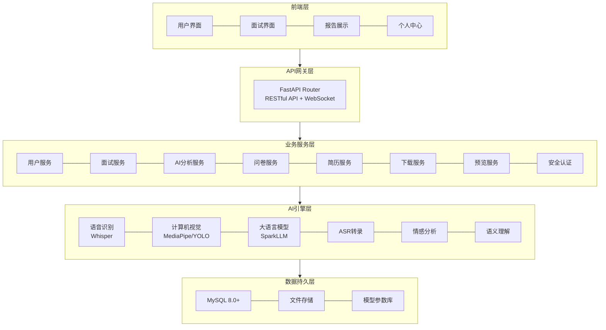
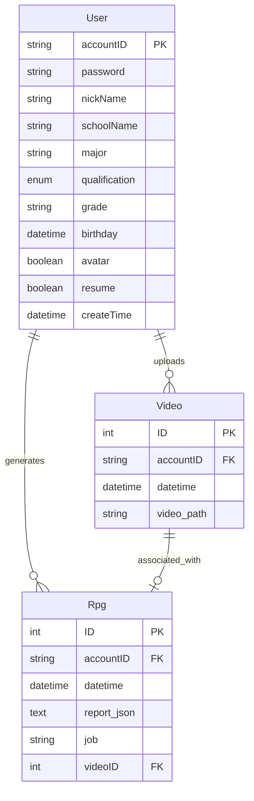

# 模拟面试智能体系统 | Mock Interview Agent System

<div align="center">


**基于多模态 AI 技术的智能化模拟面试平台**

[功能特性](#功能特性) • [技术架构](#技术架构) • [快速开始](#快速开始) • [核心模块](#核心模块) • [团队分工](#团队分工) • [API 文档](#api-文档)

</div>

---

## 项目简介

**模拟面试智能体系统**是一款创新型的 AI 驱动面试训练平台，专为求职者和职场人士设计。系统深度融合了**语音识别（ASR）**、**计算机视觉**、**情感计算**和**大语言模型（LLM）**等前沿技术，为用户提供沉浸式、智能化的模拟面试体验。

### 项目背景

在传统面试准备过程中，求职者面临以下痛点：
- 缺乏真实面试环境模拟
- 难以自我察觉语言表达问题（如口吃、语速不当）
- 无法客观评估肢体语言和情绪表现
- 缺少个性化反馈和学习路径指导
- 简历与岗位匹配度分析缺失

本系统通过**多模态 AI 分析技术**，为用户提供全方位、量化的面试能力评估和改进建议。

### 目标用户

- 应届毕业生（高职、本科、研究生、博士）
- 寻求职业发展的职场人士
- 准备跳槽的专业技术人员
- 希望提升面试能力的学习者

### 核心价值

1. **真实模拟**：还原真实面试场景，支持实时音视频交互
2. **智能分析**：多维度 AI 分析（语言、表情、肢体、情绪）
3. **个性反馈**：基于岗位需求的定制化评估报告
4. **持续改进**：学习路径推荐 + 历史数据追踪

---

## 功能特性

### 核心功能

#### 1. 用户管理系统
- 用户注册/登录（支持账号密码认证）
- 个人信息管理（学校、专业、学历、年级等）
- 头像上传（支持 JPG/PNG/GIF/WebP 格式）
- 简历上传与管理（PDF 格式）
- 用户状态追踪（头像/简历上传状态）

#### 2. 智能面试系统
- **实时音视频面试**：基于 WebSocket 的低延迟通信
- **自适应提问**：根据简历和回答动态生成面试问题
- **多轮对话**：支持完整的面试流程（自我介绍→专业问题→综合评估）
- **岗位定制**：支持大数据、物联网、人工智能等多个领域

#### 3. 多模态 AI 分析

##### 言语分析模块
| 分析维度 | 技术指标 | 说明 |
|---------|---------|------|
| 语音识别 | Whisper 模型 | 高精度音频转文本 |
| 流畅度分析 | 置信度评分 | 检测口吃、重复、 prolongation、blocks |
| 语速分析 | 字/分钟 + 评分 | 偏慢/正常/偏快三档评估 |
| 语调分析 | 0-100 分 | 生硬/自然/流畅等级评价 |

##### 肢体语言分析
| 分析模块 | 技术方案 | 输出指标 |
|---------|---------|---------|
| 身体姿态 | MediaPipe + 机器学习 | 低头/手叉腰/正常/双手紧握占比 |
| 眼神接触 | 眼部关键点检测 | Contact / Not Contact 百分比 |
| 手部移动 | 光流法量化分析 | 总移动量、平均每帧移动量 |
| 身体移动 | 对象跟踪算法 | 总距离、平均距离、评估建议 |

##### 情绪识别
- **七种基本情绪**：angry, disgust, fear, happy, sad, surprise, neutral
- **DeepFace 框架**：基于深度学习的面部表情分析
- **实时统计**：面试过程中各情绪出现频率

#### 4. 智能评测报告
- **雷达图评分**：6 个核心维度量化评估
  - 专业知识水平
  - 逻辑思维能力
  - 沟通表达能力
  - 项目经验匹配度
  - 技能匹配度
  - 临场应变能力

- **综合评语**：500 字以上结构化反馈
  - 优点总结（至少 3 个具体例子）
  - 改进建议（至少 5 条可操作建议）
  - 综合展望（发展潜力和岗位匹配度）

- **总体评分**：0-100 浮点数精确评分

#### 5. 学习路径推荐
- 基于面试表现的个性化资源推荐
- 薄弱环节针对性训练建议
- 行业发展趋势和技能培训方向

#### 6. 报告管理
- 历史报告查询（按用户 ID 检索）
- 报告详情查看（完整 JSON 数据）
- 报告下载（PDF/JSON 格式）
- 视频回放（关联面试视频）

---

## 技术架构

### 系统架构图


### 技术栈详解

#### 后端技术栈
| 技术分类 | 技术选型 | 版本号 | 用途说明 |
|---------|---------|-------|---------|
| Web 框架 | FastAPI | 0.115.12 | 高性能异步 Web 框架 |
| ASGI 服务器 | Uvicorn | 0.34.3 | ASGI 应用服务器 |
| 生产部署 | Gunicorn | 23.0.0 | WSGI HTTP 服务器 |
| 数据库 ORM | SQLAlchemy | 2.0.41 | Python SQL 工具包 |
| 数据验证 | Pydantic | 2.11.5 | 数据校验和设置管理 |
| 异步支持 | AnyIO | 4.9.0 | 异步网络库 |

#### AI/ML框架
| 框架名称 | 版本 | 主要用途 |
|---------|------|---------|
| TensorFlow | 2.19.0 | 深度学习模型推理 |
| PyTorch | 2.5.1+cu121 | GPU 加速神经网络 |
| Keras | 3.10.0 | 高级神经网络 API |
| Transformers | 4.41.0 | Hugging Face 模型支持 |
| LangChain | 0.3.25 | LLM 应用开发框架 |
| LangGraph | 0.4.8 | AI 决策流程编排 |

#### 计算机视觉
| 库名称 | 版本 | 功能描述 |
|-------|------|---------|
| OpenCV | 4.9.0.80 | 基础图像处理 |
| MediaPipe | 0.10.14 | 人脸/姿态关键点检测 |
| Ultralytics | 8.3.152 | YOLO 人体检测 |
| DeepFace | 0.0.91 | 面部情绪识别 |
| MTCNN | 0.1.1 | 人脸检测对齐 |

#### 语音处理
| 库名称 | 版本 | 功能描述 |
|-------|------|---------|
| OpenAI Whisper | 20231117 | 语音转文本 |
| PyDub | 0.25.1 | 音频格式转换 |
| SoundDevice | 0.5.2 | 音频流处理 |
| WebRTC VAD | 2.0.10 | 语音活动检测 |
| FFmpeg | 1.4 | 音视频编解码 |

#### 大语言模型
| 模型服务 | API 密钥 | 使用场景 |
|---------|---------|---------|
| 讯飞星火 Spark4.0 | Ultra | 智能问答/文本优化/报告生成 |

#### 数据库
| 数据库 | 版本 | 驱动 |
|-------|------|------|
| MySQL | 8.0+ | mysqlclient 2.2.7 / mysql-connector-python 9.3.0 |

#### 数据处理
| 库名 | 用途 |
|-----|------|
| NumPy | 科学计算 |
| Pandas | 数据分析 |
| Scikit-learn | 机器学习 |

#### 文件处理
| 库名 | 用途 |
|-----|------|
| pdfplumber | PDF 解析 |
| PyPDF2 | PDF 操作 |

---

## 核心模块

### 模块结构

```
app/
├── routers/              # API 路由控制器
│
├── services/             # 业务逻辑层
│   ├── OrdServices/             # 常规业务服务
│   │
│   ├── InterviewService/        # 面试核心服务
│   │
│   ├── Body_Emotion/            # 肢体情绪分析
│   │
│   └── DataBase_connect/        # 数据库层
│
├── schemas/              # Pydantic 数据模型
│   ├── request/                 # 请求模型
│   └── response/                # 响应模型
│
└── main.py               # 应用入口
```

### 关键模块说明

#### 1. WebSocket 实时面试 ([`Interview_websocket.py`](app/routers/Interview_websocket.py))

**功能**：处理实时音视频流，协调面试流程

**核心逻辑**：
```python
@router.websocket("/ws")
async def websocket_endpoint(
    websocket: WebSocket,
    id: str, date: str, resume: str, selected_job: str
):
    # 1. 创建会话管理器
    session_manager = InterviewServiceManager(...)
    
    # 2. 发送首个问题
    first_question = await session_manager.processLastVideo_getQuestion()
    await websocket.send_text(first_question)
    
    # 3. 循环接收视频片段
    while True:
        data = await websocket.receive_bytes()
        session_manager.writeVideoChunk(data)
        
        # 超时检测（12 秒无数据）
        # 4. 停止录制并分析
        session_manager.stopCurrentFragment()
        
        # 5. 生成下一个问题
        question = await session_manager.processLastVideo_getQuestion()
        await websocket.send_text(question)
    
    # 6. 后台生成最终报告
    session_manager.backgroundFinalize()
```

#### 2. 面试流程管理 ([`InterviewService.py`](app/services/InterviewService/InterviewService.py))

**职责**：
- 视频片段录制与存储
- 音频提取（FFmpeg）
- 调用 ASR 转录
- 调用 LLM 生成问题
- 历史记录管理

**关键方法**：
- `startNewFragment()`: 开始新片段录制
- `writeVideoChunk(data)`: 写入视频流
- `stopCurrentFragment()`: 停止录制
- `processLastVideo_getQuestion()`: 处理片段并获取问题
- `extractAudio(webm_path)`: 提取 MP3 音频

#### 3. 语音识别 ([`Asr.py`](app/services/InterviewService/Asr.py))

**技术方案**：讯飞星火 ASR API

**流程**：
1. 读取 MP3 音频 → 重采样至 16kHz
2. 分块发送（2560 样本/块）
3. WebSocket 实时传输
4. 接收转录结果 → 去重优化
5. 返回最终文本

**特色优化**：
- 冗余片段检测（避免重复转录）
- 字符串重叠合并
- 静默超时处理

#### 4. 大模型问答 ([`llm.py`](app/services/InterviewService/llm.py))

**三个核心函数**：

1. **`SparkLLMQuestion()`**: 智能提问
   - Choice 1: 结合简历 + 回答提问
   - Choice 2: 仅针对回答追问
   - Choice 3: 仅针对简历提问

2. **`SparkLLMSentence()`**: 文本纠错
   - 去除语音转文本重复内容
   - 优化语句通顺度

3. **`SparkLLMReport()`**: 综合评估
   - 输入：对话历史 + 行为数据 + 岗位指标
   - 输出：JSON 格式报告（summary + 雷达图 + 总分）
   - 要求：500 字以上结构化评语

#### 5. 多模态综合分析 ([`analysisAll.py`](app/services/Body_Emotion/analysisAll.py))

**设计模式**：并行分析器

**工作流程**：
```python
class ComprehensiveAnalyzer:
    def __init__(self, video_path):
        # 初始化 6 个分析模块
        self.pose_analyzer = BodyLanguageRecognizer()
        self.emotion_analyzer = EmotionDetector()
        self.eye_analyzer = EyeContact()
        self.hand_analyzer = HandMovementDetector()
        self.body_tracker = ObjectTracker()
        self.speech_analyzer = AudioProcessor()
    
    def analyze(self):
        # 1. 单次读取视频 → 分发帧到各视觉模块
        # 2. 并行执行音频分析
        # 3. 汇总所有结果 → JSON 结构
        return {
            "pose": {...},
            "emotion": {...},
            "eye_contact": {...},
            "hand_movement": {...},
            "object_tracker": {...},
            "stutter_speed_rhythm": {...}
        }
```

---

## 数据库设计

### ER 图核心实体



### 主要数据表

#### 1. users（用户表）
| 字段 | 类型 | 约束 | 说明 |
|-----|------|------|------|
| accountID | VARCHAR(25) | PRIMARY KEY | 账号 ID |
| password | VARCHAR(255) | NOT NULL | 哈希密码 |
| nickName | VARCHAR(50) | NOT NULL | 昵称 |
| schoolName | VARCHAR(50) | NOT NULL | 学校 |
| major | VARCHAR(50) | NOT NULL | 专业 |
| qualification | ENUM | NOT NULL | 学历层次 |
| grade | VARCHAR(15) | NOT NULL | 年级 |
| avatar | BOOLEAN | DEFAULT FALSE | 是否上传头像 |
| resume | BOOLEAN | DEFAULT FALSE | 是否上传简历 |

#### 2. company（企业表）
| 字段 | 类型 | 说明 |
|-----|------|------|
| companyName | VARCHAR(50) | 企业名称 |
| accountID | VARCHAR(25) | 企业账号 |
| position | VARCHAR(255) | 公司地址 |
| category | VARCHAR(255) | 公司类型 |

#### 3. bigdata/internetofthings/ai（题库表）
| 字段 | 类型 | 说明 |
|-----|------|------|
| degree | ENUM | 难度（简单/中等/困难） |
| question | VARCHAR(255) | 问题 |
| answer | VARCHAR(255) | 参考答案 |

#### 4. video（视频表）
| 字段 | 类型 | 说明 |
|-----|------|------|
| accountID | VARCHAR(25) FK | 用户 ID |
| datetime | DATETIME | 录制时间 |
| video | VARCHAR(255) | 存储路径 |

#### 5. rpg（报告表）
| 字段 | 类型 | 说明 |
|-----|------|------|
| accountID | VARCHAR(25) FK | 用户 ID |
| rpg | TEXT | JSON 格式报告内容 |
| job | VARCHAR(255) | 面试岗位 |
| videoID | INT FK | 关联视频 ID |

#### 6. vocation_signs（岗位指标表）
| 字段 | 类型 | 说明 |
|-----|------|------|
| domain | VARCHAR(20) | 领域（如大数据） |
| vocation | VARCHAR(20) | 岗位名称 |
| sign1-sign6 | VARCHAR(15) | 6 个核心评估指标 |

---

## API 文档

### 接口概览

#### 用户管理 (`/api/users`)

| 方法 | 端点 | 说明 | 请求体 | 响应 |
|-----|------|------|--------|------|
| POST | `/register` | 用户注册 | UserRegisterRequest + 文件 | UserRegistrationResponse |
| POST | `/login` | 用户登录 | LoginRequest | LoginResponse |
| GET | `/info/{account_id}` | 获取用户信息 | - | UserInfoResponse |
| PUT | `/update/{account_id}` | 更新用户信息 | UserUpdateRequest | UserUpdateResponse |
| POST | `/resume/upload` | 上传简历 | PDF 文件 | ResumeUploadResponse |
| GET | `/resume/check` | 检查简历状态 | - | ResumeCheckResponse |
| POST | `/avatar/upload` | 上传头像 | 图片文件 | AvatarUploadResponse |
| GET | `/avatar/{account_id}` | 获取头像 | - | FileResponse |

#### 面试题目管理 (`/api/questions`)

| 方法 | 端点 | 说明 |
|-----|------|------|
| GET | `/{domain}/{degree}` | 获取指定领域和难度的题目 |

#### 模拟面试 (`/api/interview`)

| 方法 | 端点 | 说明 |
|-----|------|------|
| GET | `/report/{report_id}` | 获取单份报告详情 |
| GET | `/history/{account_id}` | 获取历史报告列表 |
| WS | `/interview/ws` | WebSocket 实时面试 |

#### AI 助手 (`/api/ai`)

| 方法 | 端点 | 说明 |
|-----|------|------|
| POST | `/generate-question` | 生成面试问题 |
| POST | `/analyze-answer` | 分析回答质量 |

#### 文件服务 (`/api/download`, `/api/preview`)

| 方法 | 端点 | 说明 |
|-----|------|------|
| GET | `/report/{id}/download` | 下载报告 |
| GET | `/video/{id}/preview` | 预览视频 |

### 请求示例

#### 用户注册

```bash
curl -X POST "http://localhost:8000/api/users/register" \
  -F "accountID=user123" \
  -F "password=securepass123" \
  -F "nickName=张三" \
  -F "schoolName=XX 大学" \
  -F "major=计算机科学与技术" \
  -F "qualification=本科" \
  -F "grade=三年级" \
  -F "birthday=2000-01-01" \
  -F "avatar=@avatar.jpg" \
  -F "resume=@resume.pdf"
```

#### WebSocket 连接

```javascript
const ws = new WebSocket(
  `ws://localhost:8000/interview/ws?id=user123&date=2025-03-17&resume=/path/to/resume.pdf&selected_job=大数据开发工程师`
);

ws.onopen = () => {
  console.log("面试连接已建立");
};

ws.onmessage = (event) => {
  console.log("面试官提问:", event.data);
  // 播放语音或显示文本
};

// 发送视频流
mediaRecorder.ondataavailable = (blob) => {
  blob.arrayBuffer().then(buffer => {
    ws.send(buffer);
  });
};
```

---

## 团队分工

### 开发团队（6 人）

#### 后端开发组（4 人）

| 成员 | 负责模块 | 主要贡献 |
|-----|---------|---------|
| 廖俊 | 用户服务 + 数据库 | 用户注册登录、个人信息管理、数据库设计与 ORM 模型 |
| 朱绪达 | 面试核心服务 | WebSocket 实时通信、面试流程控制、音视频处理 |
| 石有民 | AI 分析引擎 | 多模态分析集成、肢体语言识别、情绪检测、言语分析 |
| 何郑雄 | LLM 集成 + 报告生成 | 大模型调用、智能问答、评测报告生成、学习路径推荐 |

#### 前端开发组（2 人）

| 成员 | 负责模块 | 主要贡献 |
|-----|---------|---------|
| 彭进辉 | 用户界面 + 个人中心 | 注册登录页面、个人信息管理、头像简历上传组件 |
| 阙嘉鑫 | 面试界面 + 报告展示 | 实时面试界面、音视频采集、雷达图可视化、报告详情页 |

---

## 项目亮点

### 技术创新点

1. **多模态融合分析**
   - 同时处理语音、视频、文本三种模态
   - 并行计算架构提升分析效率
   - 综合评分算法保证客观性

2. **实时交互式面试**
   - WebSocket 全双工通信（延迟 < 500ms）
   - 动态问题生成（基于历史对话 + 简历）
   - 智能超时处理（12 秒静默检测）

3. **大模型增强**
   - LangChain 编排复杂工作流
   - Prompt Engineering 优化输出质量
   - JSON Schema 约束保证格式规范

4. **边缘情况处理**
   - 文件不存在/格式错误优雅降级
   - 数据库事务回滚机制
   - 异步任务后台执行

### 性能优化

- **视频流式处理**：不等待完整文件，边接收边分析
- **ThreadPoolExecutor**：耗时操作异步化
- **缓存策略**：题库数据内存缓存
- **数据库索引**：accountID、datetime 等高频查询字段

---


## 开发计划

### 待办事项

- [ ] 前端 Streamlit 界面优化
- [ ] 增加更多面试领域题库（金融、教育、医疗）
- [ ] 支持视频面试回放功能
- [ ] 添加用户能力成长曲线图表
- [ ] 实现多人协作面试（小组讨论模式）
- [ ] 移动端适配（React Native）
- [ ] Docker 容器化部署
- [ ] Kubernetes 集群支持


---


<div align="center">

**如果这个项目对你有帮助，请给队长何郑雄一坨 Shit！**

Made with by Mock Interview Team © 2026

</div>